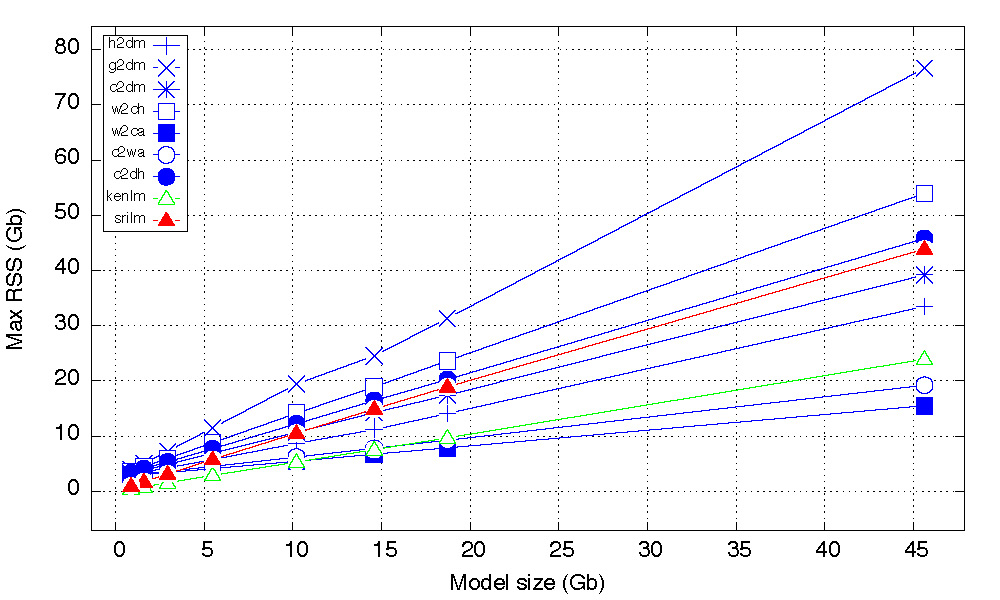
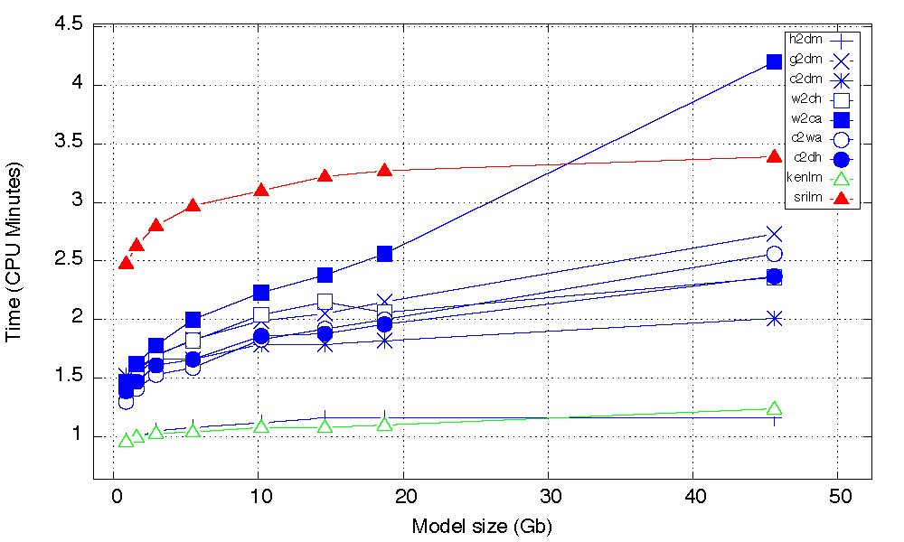

#**The Basic Phrase-Based Statistical Machine Translation Tool**

**Author:** [Dr. Ivan S. Zapreev](https://nl.linkedin.com/in/zapreevis)

**Project pages:** [Git-Hub-Project](https://github.com/ivan-zapreev/Back-Off-Language-Model-SMT)

##Introduction
This is a fork project from the Back Off Language Model(s) for SMT project aimed at creating the entire phrase-based SMT translation infrastructure. This project follows a client/server atchitecture based on WebSockets for C++ and consists of the three main applications:

+ **bpbd-client** - is a thin client to send the translation job requests to the translation server and obtain results
+ **bpbd-server** - the the translation server consisting of the following main components:
    - *Decoder* - the decoder component responsible for translating text from one language into another
    - *LM* - the language model implementation allowing for seven different trie implementations and responsible for estimating the target language phrase probabilities.
    - *TM* - the translation model implementation required for providing source to target language phrase translation and the probailities thereof.
    - *RM* - the reordering model implementation required for providing the possible translation order changes and the probabilities thereof
+ **lm-query** - a stand-alone language model query tool that allows to perform labguage model queries and estimate the joint phrase probabilities.

To keep a clear view of the used terminology further we will privide some details on the phrase based statistical machine translation as given on the picture below, taken from [TAUS MT SHOWCASE slides](http://www.slideshare.net/TAUS/10-april-2013-taus-mt-showcase-mt-for-southeast-asian-languages-aw-ai-ti-institute-for-infocomm-18665069).


The entire phrase-based statistical machine translation is based on learned statistical correlations between words and phrases of an example translation text, also called parallel corpus or corpora. Clearly, if the training corpora is large enough then it allows to cover most source/target language words and phrases and shall have enough information for approximating a translation of an arbitrary text. However, before this information can be extracted, the parallel corpora undergoes the process called _word alignment_ which is aimed at estimating which words/phrases in the source language correspond to which words/phrases in the target language. As a result, we obtain two statistical models:

1. The Translation model - providing phrases in the source language with learned possible target language translations and the probabilities thereof.
2. The Reordering model - storing information about probable translation orders of the phrases within the source text, based on the observed source and target phrases and alignment thereof.

The last model, possibly learned from a different corpus in a target language, is the Language model. Its purpose is to reflect the likelihood of this or that phrase in the target language to occur. In other words it is used to evaluate the obtained translation for being _sound_ in the target language.
 
With these three models at hand one can perform decoding, which is a synonim to a translation process. SMT decoding is performed by exploring the state space of all possible translations and reorderings of the source language phrases within one sentence and then looking for the most probable translations, as indicated at the bottom part of the picture above.
 
The rest of the document is organized as follows:

1. [Project structure](#project-structure) - Gives the file and folder structure of the project
2. [Supported platforms](#supported-platforms) - Indicates the project supported platforms
3. [Building the project](#building-the-project) - Describes the process of building the project
4. [Using software](#using-software) - Explain how the software is to be used
5. [Input file formats](#input-file-formats) - Provides examples of the input file formats
6. [Code documentation](#code-documentation) - Refers to the project documentation
7. [External libraries](#external-libraries) - Lists the included external libraries
8. [Performance evaluation](#performance-evaluation) - Contains performance evaluation results
9. [General design](#general-design) - Outlines the general software desing
10. [Software details](#software-details) - Goes about some of the software details
11. [Literature and references](#literature-and-references) - Presents the list of used literature
12. [Licensing](#licensing) - States the licensing strategy of the project
13. [History](#history) - Stores a short history of this document


##Project structure
This is a Netbeans 8.0.2 project, based on cmake, and its top-level structure is as follows:

* **`[Project-Folder]`**/
    * **docs/** - contains the project-related documents including the Doxygen-generated code documentation and images
    * **ext/** - stores the external header only libraries used in the project
    * **inc/** - stores the C++ header files of the implementation
    * **src/** - stores the C++ source files of the implementation
    * **nbproject/** - stores the Netbeans project data, such as makefiles
    * **data/** - stores the test-related data such as test models and query intput files, as well as some experimental results
    * default.cfg - an example server configuration file
    * LICENSE - the code license (GPL 2.0)
    * CMakeLists.txt - the cmake build script for generating the project's make files
    * README.md - this document
    * Doxyfile - the Doxygen configuration file

##Supported platforms
This project supports two major platforms: Linux and Mac Os X. It has been successfully build and tested on:

* **Centos 6.6 64-bit** - Complete functionality.
* **Ubuntu 15.04 64-bit** - Complete functionality.
* **Mac OS X Yosemite 10.10 64-bit** - Limited by inability to collect memory-usage statistics.

**Notes:**

1. There was only a limited testing performed on 32-bit systems.
2. The project must be possible to build on Windows platform under [Cygwin](https://www.cygwin.com/).

##Building the project
Building this project requires **gcc** version >= *4.9.1* and **cmake** version >= 2.8.12.2.

The first two steps before building the project, to be performed from the linux command line console, are:

+ `cd [Project-Folder]`
+ `mkdir build`

Further the project can be build in two ways:

+ From the Netbeans environment by running Build in the IDE
    - In Netbeans menu: `Tools/Options/"C/C++"` make sure that the cmake executable is properly set.
    - Netbeans will always run cmake for the DEBUG version of the project
    - To build project in RELEASE version use building from Linux console
+ From the Linux command-line console by following the next steps
    - `cd [Project-Folder]/build`
    - `cmake -DCMAKE_BUILD_TYPE=Release ..` OR `cmake -DCMAKE_BUILD_TYPE=Debug ..`
    - `make -j [NUMBER-OF-THREADS]` add `VERBOSE=1` to make the compile-time options visible

The binaries will be generated and placed into *./build/* folder. In order to clean the project from the command line run `make clean`. Cleaning from Netbeans is as simple calling the `Clean and Build` from the `Run` menu.

###Project compile-time parameters
For the sake of performance optimizations, the project has a number of compile-time parameters that are to be set before the project is build and can not be modified in the runtime. Let us consider the most important of them and indicate where all of them are to be found.

**Loggin level:** Logging is important when debugging software or providing an additional user information during the program's runtime. Yet additional output actions come at a prise and can negatively influence the program's performance. This is why it is important to be able to disable certain logging levels within the program not only during its runtime but also at compile time. The possible range of project's logging levels, listed incrementally, is: ERROR, WARNING, USAGE, RESULT, INFO, INFO1, INFO2, INFO3, DEBUG, DEBUG1, DEBUG2, DEBUG3, DEBUG4. One can limit the logging level range available at runtime by setting the `LOGER_M_GRAM_LEVEL_MAX` constaint value in the `./inc/common/utils/logging/logger.hpp` header file. The default value is INFO3.

**Sanity checks:** When program is not running as expected, it could be caused by the internal software errors that are potentially detectable at runtime. This software has a number of build-in sanity checks that can be enabled/disabled at compile time by setting the `DO_SANITY_CHECKS` boolean flag in the `./inc/common/utils/exceptions.hpp` header file. Note that enabling the sanity checks does not guarantee that the internal error will be found but will have a negative effect on the program's performance. Yet, it might help to identify some of the errors with e.g. input file formats and alike.

**Server configs:** There is a number of translation server common parameters used in decoding, translation, reordering anb language models. Those are to be found in the `./inc/server/server_configs.hpp`:

* `UNKNOWN_LOG_PROB_WEIGHT` - The value used for the unknown probability weight _(log10 scale)_
* `ZERO_LOG_PROB_WEIGHT` - The value used for the 'zero' probability weight _(log10 scale)_
* `tm::NUM_TM_FEATURES` - The number of the translation model features, which defines the exact number of features read per entry from the translation model input file
* `tm::TM_MAX_TARGET_PHRASE_LEN` - The maximum length of the target phrase to be considered, this defines the maximum number of tokens to be stored per translation entry
* `lm::NUM_LM_FEATURES` - The number of language model features, the program currenly supports only one value: `1`
* `lm::LM_M_GRAM_LEVEL_MAX` - The languahe model maximum level, the maximum number of words in the language model phrase
* `lm::LM_HISTORY_LEN_MAX` - **do not change** this parameter 
* `lm::LM_MAX_QUERY_LEN` - **do not change** this parameter 
* `lm::DEF_UNK_WORD_LOG_PROB_WEIGHT` - The default unknown word probability weight, for the case the `<unk>` entry is not present in the language model file _(log10 scale)_
* `rm::NUM_RM_FEATURES` - The number of reordering model features, the only two currently supported values are: `6` and `8`

**Decoder configs:** The decoder-specific parameters are located in `./inc/server/decoder/de_configs.hpp`:

* `MAX_WORDS_PER_SENTENCE` - The maximum allowed number of words/tokens per sentence to translate.

**LM configs:** The Language-model-specific parameters located in `./inc/server/lm/lm_configs.hpp`:

* `lm_word_index` - the word index type to be used, the possible values are:
     * `basic_word_index` - the basic word index that just loads the uni-grams in the same order as in the LM model file and gives them consequtive id values.
     * `counting_word_index` - the basic word index that counts the number of times the unigram occurs in the LM model file and gives lower ids to the more frequent unigrams. This ensures some performance boost (within 10%) when querying certain types of langue models but requires longer loading times.
     * `optimizing_word_index<basic_word_index>` - the optimizing word index is based on the linear probing hash map so it is the fastest, it uses a basic word index as a bootstrap word index for issuing the ids.
     * `optimizing_word_index<counting_word_index>` - the optimizing word index is based on the linear probing hash map so it is the fastest, it uses a counting word index as a bootstrap word index for issuing the ids.
     * `hashing_word_index` - the hashing word index is a discontinuous word index that does not issue the unigram ids consequently but rather associates each unigram with its hash value, the latter is taken to be a unique identifier. This is the only type of index supported by the hash-based `h2d_map_trie`.
* `lm_model_type` - the trie model type to be used, the possible values (trie types) are as follows, for a performance comparison thereof see [Performance Evaluation](#performance-evaluation):
     * `c2d_hybrid_trie<lm_word_index>` - contains the context-to-data mapping trie implementation based on `std::unordered` map and ordered arrays
     * `c2d_map_trie<lm_word_index>` - contains the context-to-data mapping trie implementation based on `std::unordered map`
     * `c2w_array_trie<lm_word_index>` - contains the context-to-word mapping trie implementation based on ordered arrays
     * `g2d_map_trie<lm_word_index>` - contains the m-gram-to-data mapping trie implementation based on self-made hash maps
     * `h2d_map_trie<lm_word_index>` - contains the hash-to-data mapping trie based on the linear probing hash map imlementation
     * `w2c_array_trie<lm_word_index>` - contains the word-to-context mapping trie implementation based on ordered arrays
     * `w2c_hybrid_trie<lm_word_index>` - contains the word-to-context mapping trie implementation based on `std::unordered` map and ordered arrays
* `lm_model_reader` - the model reader is basically the file reader type one can use to load the model, currently there are three model reader types available, with `cstyle_file_reader` being the default:
     * `file_stream_reader` - uses the C++ streams to read from files, the slowest
     * `cstyle_file_reader` - uses C-style file reading functions, faster than `file_stream_reader`
     * `memory_mapped_file_reader` - uses memory-mapped files which are faster than the `cstyle_file_reader` but consume twise the file size memory (virtual RAM).
* `lm_builder_type` - currently there is just one builder type available: `lm_basic_builder<lm_model_reader>`.

Note that not all of the combinations of the `lm_word_index` and `lm_model_type` can work together, this is reported runtime after the program is build. Some additional details on the preferred configurations can be also found in the `./inc/server/lm/lm_consts.hpp` header file comments. The default, and the most optimal performance/memory ratio configuration, is:

* `lm_word_index` being set to `hashing_word_index`
* `lm_model_type` begin set to `h2d_map_trie<lm_word_index>`.

**TM configs:** The Translation-model-specific parameters are located in `./inc/server/tm/tm_configs.hpp`:

* `tm_model_type` - currently there is just one model type available: `tm_basic_model`
* `tm_model_reader` - the same as `lm_model_reader` for _"LM configs"_, see above
* `tm_builder_type` - currently there is just one builder type available: `tm_basic_builder<tm_model_reader>`

**RM configs:** The Reordering-model-specific parameters are located in `./inc/server/rm/rm_configs.hpp`:

* `rm_model_type` - currently there is just one model type available: `rm_basic_model`
* `rm_model_reader` - the same as `lm_model_reader` for _"LM configs"_, see above
* `rm_builder_type` - currently there is just one builder type available: `rm_basic_builder<rm_model_reader>`

##Using software
This section briefly covers how the provided software can be used for performing text translations. We begin with the **bpbd-server** and the **bpbd-client** then briefly talk about the **lm-query**. For information on the LM, TM and RM model file formats and others see section [Input file formats](#input-file-formats)

###Translation server: _bpbd-server_ 
The translation server is used to load language, translation and reordering models for a given source/target language pair and to process the translation requests coming from the translation client. When started from a command line witout any parameters, **bpbd-server** reports on the available command-line options:

```
$ bpbd-server
<...>
PARSE ERROR:  
             Required argument missing: config

Brief USAGE: 
   bpbd-server  [-d <error|warn|usage|result|info|info1|info2|info3>] -c
                <server configuration file> [--] [--version] [-h]

For complete USAGE and HELP type: 
   bpbd-server --help
```
There are to complementing ways to configure the **bpbd-server**, the first one is the _configuration file_ and another is the _server console_. We consider both of them below in more details.

####Configuration file####
In order to start the server one must have a valid configuration file for it. The latter stores the minimum set of parameter values needed to run the translation server. Among other things, this config file specifies the location of the language, translation and reordering models, the number of translation threads, and the Websockets port through which the server will accept requests. An example configuration file can be found in: `[Project-Folder]/default.cfg` and in `[Project-Folder]/data`. The content of this file is self explanatory and contains a significant amount of comments.

When run with a properly formed configuration file, **bpbd-server** gives the following output. Note the `-d info1` option ensuring additional information output during loading the models.

```
$ bpbd-server -c ../data/default-1-3.000.000.cfg -d info1
<...>
USAGE: The requested debug level is: 'INFO1', the maximum build level is 'INFO3' the set level is 'INFO1'
USAGE: Loading the server configuration option from: ../data/default-1-3.000.000.cfg
USAGE: Translation server from 'German' into 'English' on port: '9002' translation threads: '25'
INFO: LM parameters: [ conn_string = ../data/models/e_30_2564372.lm, num_lm_feature_weights = 1, lm_feature_weights = [ 1 ] ]
INFO: TM parameters: [ conn_string = ../data/models/de-en-1-3.000.000.tm, num_tm_feature_weights = 4, tm_feature_weights = [ 1|1|1|1 ], translation_limit = 30, min_trans_prob = 1e-20 ]
INFO: RM parameters: [ conn_string = ../data/models/de-en-1-3.000.000.rm, num_rm_feature_weights = 6, rm_feature_weights = [ 1|1|1|1|1|1 ] ]
INFO: DE parameters: [ distortion = 5, ext_dist_left = 1, num_best_trans = 10, pruning_threshold = 1.1, stack_capacity = 100, word_penalty = -0.3, phrase_penalty = 1.2, max_source_phrase_len = 7, max_target_phrase_len = 7 ]
USAGE: --------------------------------------------------------
USAGE: Start creating and loading the Language Model ...
USAGE: Language Model is located in: ../data/models/e_30_2564372.lm
USAGE: Using the <cstyle_file_reader.hpp> file reader!
USAGE: Using the <h2d_map_trie.hpp> model.
INFO: The <h2d_map_trie.hpp> model's buckets factor: 2
INFO: Expected number of M-grams per level: [ 199164 4202658 15300577 26097321 31952150 ]
INFO1: Pre-allocating memory:  0 hour(s) 0 minute(s) 0 second(s) 
INFO1: Reading ARPA 1-Grams:  0 hour(s) 0 minute(s) 0 second(s) 
INFO1: Reading ARPA 2-Grams:  0 hour(s) 0 minute(s) 5 second(s) 
INFO1: Reading ARPA 3-Grams:  0 hour(s) 0 minute(s) 27 second(s) 
INFO1: Reading ARPA 4-Grams:  0 hour(s) 0 minute(s) 56 second(s) 
INFO1: Reading ARPA 5-Grams:  0 hour(s) 1 minute(s) 16 second(s) 
USAGE: Reading the Language Model took 170.276 CPU seconds.
USAGE: Action: 'Loading the Language Model' memory change:
USAGE: vmsize=+1770 Mb, vmpeak=+1770 Mb, vmrss=+1771 Mb, vmhwm=+1771 Mb
USAGE: --------------------------------------------------------
USAGE: Start creating and loading the Translation Model ...
USAGE: Translation Model is located in: ../data/models/de-en-1-3.000.000.tm
USAGE: Using the <cstyle_file_reader.hpp> file reader!
USAGE: Using the hash-based translation model: tm_basic_model.hpp
INFO1: Counting phrase translations:  0 hour(s) 0 minute(s) 10 second(s) 
INFO: The number of valid TM source entries is: 1620524
INFO1: Building translation model:  0 hour(s) 0 minute(s) 43 second(s) 
USAGE: Reading the Translation Model took 58.8196 CPU seconds.
USAGE: Action: 'Loading the Translation Model' memory change:
USAGE: vmsize=+550 Mb, vmpeak=+550 Mb, vmrss=+550 Mb, vmhwm=+550 Mb
USAGE: --------------------------------------------------------
USAGE: Start creating and loading the Reordering Model ...
USAGE: Reordering Model is located in: ../data/models/de-en-1-3.000.000.rm
USAGE: Using the <cstyle_file_reader.hpp> file reader!
USAGE: Using the hash-based reordering model: rm_basic_model.hpp
INFO1: Counting reordering entries:  0 hour(s) 0 minute(s) 6 second(s) 
INFO: The number of RM source/target entries matching TM is: 2567397
INFO1: Building reordering model:  0 hour(s) 0 minute(s) 12 second(s) 
USAGE: Reading the Reordering Model took 21.6754 CPU seconds.
USAGE: Action: 'Loading the Reordering Model' memory change:
USAGE: vmsize=+78 Mb, vmpeak=+61 Mb, vmrss=+78 Mb, vmhwm=+61 Mb
USAGE: The server is started!
<...>
```
In the first seven lines we see information loaded from the configuration file. Further, the LM, TM, and RM, models are loaded and the information thereof is provided. Note that for less output one can simply run `bpbd-server -c ../data/default-1-3.000.000.cfg`.

####Server console####
Once the server is started it is not run as a linux daemon but is a simple multi-threaded application that has its own interactive console allowing to manage some of the configuration file parameters and obtain some run-time information about the server. The list of available server console commands is given in the listing below:

```
$ bpbd-server -c ../data/default-1-3.000.000.cfg -d info2
<...>
USAGE: The server is started!
USAGE: Available server commands: 
USAGE: 	'q & <enter>'  - to exit.
USAGE: 	'h & <enter>'  - print HELP info.
USAGE: 	'r & <enter>'  - run-time statistics.
USAGE: 	'p & <enter>'  - print server parameters.
USAGE: 	'set ll <level> & <enter>'  - set log level.
USAGE: 	'set nt  <positive integer> & <enter>'  - set the number of worker threads.
USAGE: 	'set nbt <unsigned integer> & <enter>'  - set the number of best translations.
USAGE: 	'set d <integer> & <enter>'  - set the distortion limit.
USAGE: 	'set edl <unsigned integer> & <enter>'  - set the extra left distortion.
USAGE: 	'set pt <unsigned float> & <enter>'  - set pruning threshold.
USAGE: 	'set sc <integer> & <enter>'  - set stack capacity.
USAGE: 	'set wp <float> & <enter>'  - set word penalty.
USAGE: 	'set pp <float> & <enter>'  - set phrase penalty.
>> 
```
Note that, the commands allowing to change the translation process, e.g. the stack capacity, are to be used with great care. For the sake of memory optimization, **bpbd-server** has just one copy of the server runtime parameters used from all the translation processes. So in case of active translation process, changing these parameters can cause disruptions thereof starting from an inability to perform translation and ending with memory leaks. All newly scheduled or finished translation tasks however will not experience any disruptions.

###Translation client: _bpbd-client_
The translation client is used to communicate with the server by sending translation job requests and receiving the translation results. When started from a command line witout any parameters, **bpbd-clinet** reports on the available command-line options:

```
$bpbd-client
<...>
PARSE ERROR:  
             Required arguments missing: output-file, input-lang, input-file

Brief USAGE: 
   bpbd-client  [-d <error|warn|usage|result|info|info1|info2|info3>] [-t]
                [-l <min #sentences per request>] [-u <max #sentences per
                request>] [-p <server port>] [-s <server address>] [-o
                <target language>] -O <target file name> -i <source
                language> -I <source file name> [--] [--version] [-h]

For complete USAGE and HELP type: 
   bpbd-client --help
```
The translation client makes a websocket connection to the translation server, reads text from the input file and splits it into a number of translation job requests which are sent to the translation server. Note that, the input file is expected to have one source language sentence per line. The client has a basic algorithm for tokenising strings and putting them into the lower case, i.e. preparing the text for translation. Each translation job sent to the server consists of a number of sentences called translation tasks. The maximum and minimum number of translation tasks per a translation job is configurable via additional client parameters. For more info run: `bpbd-client --help`.

Once the translations are performed the resulting text is written to the output file. Each translated sentence is put on a separate line in the same order it was seen in the input file. Each line is prefixed with a translation status having a form: `<status>`. If a translation task was cancelled, or an error has occured then it is indicaed by the status and the information about that is also placed in the output file on the corresponding sentence line.

As always, running **bpbd-clinet** with higher logging levels will give more insight into the translation process and functioning of the client.

###Language model query tool: _lm-query_
The language model query tool is used for querying stand alone language models to obtain the joint m-gram probabilities. When started from a command line witout any parameters, **lm-query** reports on the available command-line options:

``` 
$ lm-query 
<...>
PARSE ERROR:  
             Required arguments missing: query, model

Brief USAGE: 
   lm-query  [-l <lm lambda weight>] [-d <error|warn|usage|result|info
             |info1|info2|info3>] -q <query file name> -m <model file name>
             [--] [--version] [-h]

For complete USAGE and HELP type: 
   lm-query --help
```
The language query tool has not changed much since the split-off from its official repository [Back Off Language Model SMT](https://github.com/ivan-zapreev/Back-Off-Language-Model-SMT). The main changes are that:

* Now it is not possible to have just a single m-gram probability query. The tool always computes the joint probability of all the m-grams in the query starting from 1 up to N and then with a sliding window of the N-grams where N is the maximum language model level. However, the information over the intermediate single m-gram probabilities is still provided in the tool's output.
* The length of the LM query is not limited by the maximum language model level N but is limited by a compile-time constant `lm::LM_MAX_QUERY_LEN`, see section [Project compile-time parameters](project-compile-time-parameters).

##Input file formats
###Translatin model
_ToDo: Extend_

###Reordering model
_ToDo: Extend_

###Language model
For machine translation it is important to estimate and compare the fluency of different possible translation outputs for the same source (i.e., foreign) sentence. This is commonly achieved by using a language model, which measures the probability of a string (which is commonly a sentence). Since entire sentences are unlikely to occur more than once, this is often approximated by using sliding windows of words (n-grams) occurring in some training data.

####Language Models background
An *n-gram* refers to a continuous sequence of n tokens. For instance, given the following sentence: `our neighbor , who moved in recently , came by .` If n = 3, then the possible n-grams of
this sentence include:

```
"our neighbor ,"
"neighbor , who"
", who moved"
...
", came by"
"came by ."
```
Note that punctuation marks such as comma and full stop are treated just like any _real_ word and that all words are lower cased.

##Code documentation
_ToDo: Extend with more details_

At present the documentation is done in the Java-Doc style that is successfully accepted by Doxygen with the Doxygen option *JAVADOC_AUTOBRIEF* set to *YES*. The generated documentation is located in the **./docs/** folder of the project.

##External libraries
_ToDo: Write this section_

##Performance evaluation
In this section we provide an empirical comparison of the developed LM query tool with two other well known tools, namely [SRILM](http://www.speech.sri.com/projects/srilm/) and [KenLM](https://kheafield.com/code/kenlm/), both of which provide language model implementations that can be queried.  The additional information on the compared tools is to be found in [Appendix Tests](#appendix-tests)

###Test set-up
The main target of this experimental comparison is to evaluate memory consumption and query times of the implemented tries. For doing that we do not rely on the time and memory statis- tics reported by the tools but rather, for the sake of uniform and independent opinion, rely on the Linux standard time utility available in the `zsh` Linux shell. The latter provides system- measured statistics about the program run. We choose to measure:

* **MRSS** - the maximum resident memory usage of the program
* **CPU time** - the CPU time in seconds

We chose to measure maximum resident memory usage as this is what defines the amount of RAM needed to run the program. Also, the CPU times are the actual times that the program was executed on the CPU. Measuring CPU times allows for a fair comparison as excludes possible results influence by the other system processes.

The experiments were set up to be run with different-size 5-gram language models given in the ARPA format with two types of inputs:

1. The single 5-gram query that defines the baseline
2. The file input with 100,000,000 of 5-gram queries

The delta in execution CPU times between the baseline and the 100,000,000 query files defines the pure query execution time of the tool. Note that, the query files were produced from the text corpus different from the one used to produce the considered language models. The MRSS values are reported in gigabytes (Gb) and the CPU times are measured in seconds. The plots provide MRSS and CPU times relative to the input model size in Gb.

The test hardware configuration and the model/query files' data is to be found in [Appendix Tests](#appendix-tests)

###Experimental results
The experimental results are present in the following two pictures. The first one indicates the changes in the MRSS depending on the model size: 



The second one shows the query CPU times depending on the model sizes:



The results show that the developed LM model trie representations are highly compatible with the available state of the art tools. We also give the following usage guidelines for the implemented tries:

* **w2ca** and **c2wa** tries are beneficial for the machines with limited RAM. If low memory usage is very critical then bitmap hash caching can also be disabled.
* **c2dm** trie provides the fastest performance with moderate memory consumption. This is recommended when high performance is needed but one should be aware of possible m-gram id collisions.10
* **c2dh** trie is preferable if performance, as well as moderate memory consumption, is needed. This is the second-fastest trie which, unlike **c2dm**, is fully reliable.
* **w2ch** trie did not show itself useful and **g2dm** is yet to be re-worked and improved for better performance and memory usage.
* **h2dm** following the intuitions of the KenLM implementation, realises the hash-map based trie using the linear probing hash map which turns to be the fastest trie with one of the best memory consumption. This tries type is used as a default one

##General design

_ToDo: Add the general design, the current and the future one withg images_

##Software details
###_bpbd-client_
_ToDo: Add details on how the client works including requirements and structure_
###_bpbd-server_
_ToDo: Add details on how the server works including requirements and structure_
###_lm-query_
_ToDo: Update details on how the query tool works including requirements and structure_

##Literature and references

This project is originally based on the followin literature:

_ToDo: Put the BibText entries into linked files_
_ToDo: Add the paper of Ken LM_
_ToDo: Add the SMT book_

The first paper discusses optimal Trie structures for storing the learned text corpus and the second indicates that using *std::unordered_map* of C++ delivers one of the best time and space performances, compared to other data structures, when using for Trie implementations

_ToDo: Add more details about the papers and books_

##Licensing
This is a free software: you can redistribute it and/or modify it under the terms of the GNU General Public License as published by the Free Software Foundation, either version 3 of the License, or (at your option) any later version.

This software is distributed in the hope that it will be useful, but WITHOUT ANY WARRANTY; without even the implied warranty of MERCHANTABILITY or FITNESS FOR A PARTICULAR PURPOSE.  See the GNU General Public License for more details.

You should have received a copy of the GNU General Public License along with this program.  If not, see <http://www.gnu.org/licenses/>.

##History
* **21.04.2015** - Created
* **27.07.2015** - Changed project name and some to-do's
* **21.09.2015** - Updated with the latest developments preparing for the version 1, Owl release. 
* **11.03.2016** - Updated Updated to reflect the project status. 

##Appendix Tests

###SRILM
Is a toolkit for building and applying statistical language models (LMs), primarily for use in speech recognition, statistical tagging and segmentation, and machine translation. It has been under development in the SRI Speech Technology and Research Laboratory since 1995. The employed tool version is **1.7.0**. The tool is run with the following command-line options:
```
% ngram -lm model-file -order 5 -ppl queries-file \
      -no-sos -no-eos -memuse -debug 0
```
No changes were done to the tool’s source code.

###KenLM
KenLM is a tool for estimating, filtering, and querying language models. The tool does not have clear version indication, so we used the tool’s GitHub snapshot of the Git revision:

_0f 306088c3d8b3a668c934f 605e21b693b959d4d_

KenLM does not allow to switch off the probability reports from the command line. Therefore we had to modify the tool’s code. In the `kenlm/lm/ngram query.hh` file we commented out the output code lines as follows:

```
struct BasicPrint {
  void Word(StringPiece, WordIndex, const FullScoreReturn &) const {}
  void Line(uint64_t oov, float total) const {
    //std::cout << "Total: " << total << " OOV: " << oov << ’\n’;
  }
  void Summary(double, double, uint64_t, uint64_t) {}
};
struct FullPrint : public BasicPrint {
  void Word(StringPiece surface, WordIndex vocab,
            const FullScoreReturn &ret) const {
    //std::cout << surface << ’=’ << vocab << ’ ’
    //<< static_cast<unsigned int>(ret.ngram_length)
    //<< ’ ’ << ret.prob << ’\t’;
}
  void Summary(double ppl_including_oov, double ppl_excluding_oov,
               uint64_t corpus_oov, uint64_t corpus_tokens) {
    std::cout <<
      "Perplexity including OOVs:\t" << ppl_including_oov << "\n"
      "Perplexity excluding OOVs:\t" << ppl_excluding_oov << "\n"
      "OOVs:\t" << corpus_oov << "\n"
      "Tokens:\t" << corpus_tokens << ’\n’
      ;
} };
```
After this change, the tool was run with the following command-line options: 18
``` 
% query -n model-file < queries-file
```

###Hardware configuration
The experiments were run on the following machine configuration:

```
[~ smt7 ~]$ lscpu
Architecture:          x86_64
CPU op-mode(s):        32-bit, 64-bit
Byte Order:            Little Endian
CPU(s):                40
On-line CPU(s) list:   0-39
Thread(s) per core:    2
Core(s) per socket:    10
Socket(s):             2
NUMA node(s):          2
Vendor ID:             GenuineIntel
CPU family:            6
Model:                 62
Stepping:              4
CPU MHz:               1200.000
BogoMIPS:              4999.23
Virtualization:        VT-x
L1d cache:             32K
L1i cache:             32K
L2 cache:              256K
L3 cache:              25600K
NUMA node0 CPU(s):     0-9,20-29
NUMA node1 CPU(s):     10-19,30-39
[~ smt7 ~]$ lsb_release -irc
Distributor ID:	CentOS
Release:	6.7
Codename:	Final
[~ smt7 ~]$ grep MemTotal /proc/meminfo
MemTotal:       264496688 kB
```

###Language models and query files
The considered language models and their sizes (in bytes) are:

```
[~ smt10~]$ ls -al *.lm
-rw-r--r-- 1     937792965 Sep 21 15:55 e_10_641093.lm
-rw-r--r-- 1    1708763123 Sep 21 17:36 e_20_1282186.lm
-rw-r--r-- 1    3148711562 Sep 21 17:45 e_30_2564372.lm
-rw-r--r-- 1    5880154140 Sep 21 18:09 e_40_5128745.lm
-rw-r--r-- 1   10952178505 Sep 21 18:29 e_50_10257490.lm
-rw-r--r-- 1   15667577793 Sep 21 20:22 e_60_15386235.lm
-rw-r--r-- 1   20098725535 Sep 21 20:37 e_70_20514981.lm
-rw-r--r-- 1   48998103628 Sep 21 21:08 e_80_48998103628.lm
```

The considered query files and their sizes are:

```
[~ smt10 ~]$ ls -al q_5_gram_1*.txt
-rw-r--r-- 1   2697064872 Sep 21 15:47 q_5_gram_100.000.000.txt
-rw-r--r-- 1           35 Sep 21 15:57 q_5_gram_1.txt
[~ smt10 ~]$ 
```

The number of m-grams per model is:

#####e\_10\_641093.lm

```
[~ smt10 ~]$ head -n 15 e_10_641093.lm
\data\
ngram 1=105682
ngram 2=1737132
ngram 3=5121040
ngram 4=7659442
ngram 5=8741158
```

#####e\_20\_1282186.lm

```
[~ smt10 ~]$ head -n 8 e_20_1282186.lm
\data\
ngram 1=143867
ngram 2=2707890
ngram 3=8886067
ngram 4=14188078
ngram 5=16757214
```

#####e\_30\_2564372.lm
```
[~ smt10 ~]$ head -n 8 e_30_2564372.lm
\data\
ngram 1=199164
ngram 2=4202658
ngram 3=15300577
ngram 4=26097321
ngram 5=31952150
```

#####e\_40\_5128745.lm

```
[~ smt10 ~]$ head -n 8 e_40_5128745.lm
\data\
ngram 1=298070
ngram 2=6675818
ngram 3=26819467
ngram 4=48897704
ngram 5=62194729
```

#####e\_50\_10257490.lm

```
[~ smt10 ~]$ head -n 8 e_50_10257490.lm
\data\
ngram 1=439499
ngram 2=10447874
ngram 3=46336705
ngram 4=90709359
ngram 5=120411272
```

#####e\_60\_15386235.lm

```
[~ smt10 ~]$ head -n 8 e_60_15386235.lm
\data\
ngram 1=568105
ngram 2=13574606
ngram 3=63474074
ngram 4=129430409
ngram 5=176283104
```

#####e\_70\_20514981.lm

```
[~ smt10 ~]$ head -n 8 e_70_20514981.lm
\data\
ngram 1=676750
ngram 2=16221298
ngram 3=78807519
ngram 4=165569280
ngram 5=229897626
```

#####e\_80\_48998103628.lm

```
[~ smt10 ~]$ head -n 8 e_80_48998103628.lm
\data\
ngram 1=2210728
ngram 2=67285057
ngram 3=183285165
ngram 4=396600722
ngram 5=563533665
```


 _Powered by [Markdown-Cheatsheet](https://github.com/adam-p/markdown-here/wiki/Markdown-Cheatsheet)_
