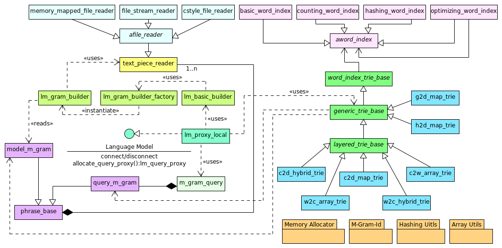

#**The Basic Phrase-Based Statistical Machine Translation Tool**

**Author:** [Dr. Ivan S. Zapreev](https://nl.linkedin.com/in/zapreevis)

**Project pages:** [Git-Hub-Project](https://github.com/ivan-zapreev/Back-Off-Language-Model-SMT)

##Introduction
This fork from the Back Off Language Model(s) for SMT project is aimed at creating an entire phrase-based statistical machine translation system. The delivered software follows a client/server architecture based on Web Sockets for C++ and consists of the three main applications::

+ **bpbd-client** - a thin client to send the translation job requests to the translation server and obtain results
+ **bpbd-server** - the translation server consisting of the following main components:
    - *Decoder* - the decoder component responsible for translating text from one language into another
    - *LM* - the language model implementation allowing for seven different trie implementations and responsible for estimating the target language phrase probabilities
    - *TM* - the translation model implementation required for providing source to target language phrase translation and the probabilities thereof
    - *RM* - the reordering model implementation required for providing the possible translation order changes and the probabilities thereof
+ **lm-query** - a stand-alone language model query tool that allows to perform language model queries and estimate the joint phrase probabilities

To keep a clear view of the used terminology further, we provide some details on the topic of phrase-based SMT, and to illustrate it, the following picture.


The entire phrase-based statistical machine translation relies on learning statistical correlations between words and
phrases in an existing source/target translation text pair, also called parallel corpus or corpora. These correlations
are learned by, generally speaking, three statistical models: TM - translation model; RM - reordering mode; and LM - language
model; briefly mentioned above. If the training corpora is large enough, then these models will possess enough information
to approximate a translation of an arbitrary text from the given source language to the given target language. Note that,
before this information can be extracted, the parallel corpora undergoes the process called _word alignment_ which is aimed
at estimating which words/phrases in the source language correspond to which words/phrases in the target language.
Let us give a more precise definition of these models:

1. Translation model - provides phrases in the source language with learned possible target language translations and the probabilities thereof.
2. Reordering model - stores information about probable translation orders of the phrases within the source text, based on the observed source and target phrases and their alignments.
3. Language model - reflects the likelihood of this or that phrase in the target language to occur. In other words, it is used to evaluate the obtained translation for being _"sound"_ in the target language.

Note that, the language model is typically learned from a different corpus in a target language.

With these three models at hand one can perform decoding, which is a synonym to a translation process. SMT decoding is performed by exploring the state space of all possible translations and reordering
of the source language phrases within one sentence. The purpose of decoding, as indicated by the maximization procedure at the bottom of the figure above, is to find a translation with the largest possible probability.
 
The rest of the document is organized as follows:

1. [Project structure](#project-structure) - Gives the file and folder structure of the project
2. [Supported platforms](#supported-platforms) - Indicates the project supported platforms
3. [Building the project](#building-the-project) - Describes the process of building the project
4. [Using software](#using-software) - Explain how the software is to be used
5. [Input file formats](#input-file-formats) - Provides examples of the input file formats
6. [Code documentation](#code-documentation) - Refers to the project documentation
7. [External libraries](#external-libraries) - Lists the included external libraries
8. [Performance evaluation](#performance-evaluation) - Contains performance evaluation results
9. [General design](#general-design) - Outlines the general software design
10. [Software details](#software-details) - Goes about some of the software details
11. [Literature and references](#literature-and-references) - Presents the list of used literature
12. [Licensing](#licensing) - States the licensing strategy of the project
13. [History](#history) - Stores a short history of this document


##Project structure
This is a Netbeans 8.0.2 project, based on cmake, and its top-level structure is as follows:

* **`[Project-Folder]`**/
    * **doc/** - contains the project-related documents including the Doxygen-generated code documentation and images
    * **ext/** - stores the external header only libraries used in the project
    * **inc/** - stores the C++ header files of the implementation
    * **src/** - stores the C++ source files of the implementation
    * **nbproject/** - stores the Netbeans project data, such as makefiles
    * **data/** - stores the test-related data such as test models and query input files, as well as some experimental results
    * default.cfg - an example server configuration file
    * LICENSE - the code license (GPL 2.0)
    * CMakeLists.txt - the cmake build script for generating the project's make files
    * README.md - this document
    * Doxyfile - the Doxygen configuration file

##Supported platforms
This project supports two major platforms: Linux and Mac Os X. It has been successfully build and tested on:

* **Centos 6.6 64-bit** - Complete functionality.
* **Ubuntu 15.04 64-bit** - Complete functionality.
* **Mac OS X Yosemite 10.10 64-bit** - Limited by inability to collect memory-usage statistics.

**Notes:**

1. There was only a limited testing performed on 32-bit systems.
2. The project must be possible to build on Windows platform under [Cygwin](https://www.cygwin.com/).

##Building the project
Building this project requires **gcc** version >= *4.9.1* and **cmake** version >= 2.8.12.2.

The first two steps before building the project, to be performed from the Linux command line console, are:

1. `cd [Project-Folder]`
2. `mkdir build`

After these are performed, the project can be build in two ways:

+ From the Netbeans environment by running Build in the IDE
    - In Netbeans menu: `Tools/Options/"C/C++"` make sure that the cmake executable is properly set.
    - Netbeans will always run cmake for the DEBUG version of the project
    - To build project in RELEASE version use building from Linux console
+ From the Linux command-line console by following the next steps
    - `cd [Project-Folder]/build`
    - `cmake -DCMAKE_BUILD_TYPE=Release ..` OR `cmake -DCMAKE_BUILD_TYPE=Debug ..`
    - `make -j [NUMBER-OF-THREADS]` add `VERBOSE=1` to make the compile-time options visible

The binaries will be generated and placed into *./build/* folder. In order to clean the project from the command line run `make clean`. Cleaning from Netbeans is as simple calling the `Clean and Build` from the `Run` menu.

###Project compile-time parameters
For the sake of performance optimizations, the project has a number of compile-time parameters that are to be set before the project is build and can not be modified in the run time. Let us consider the most important of them and indicate where all of them are to be found.

**Tuning mode:** The software can be compiled in the tuning mode, which supports the search-lattice generation for the performance tuning of the translation system. The performance is measured in terms of the translation quality measure such as BLEU. When the software is compiled in the tuning mode, it is a number of times slower than in the regular, i.e. production, mode. Enabling of the tuning mode can be done by setting the value of the `IS_SERVER_TUNING_MODE` macro to `true` in the `./inc/server/server_configs.hpp` file and then re-compiling the software. The tuning mode only has impact on the **bpbd-server** executable. The lattice dumping is then not immediately enabled and configured. The latter can be done via the server's [configuration file](#configuration-file).

**Logging level:** Logging is important when debugging software or providing an additional user information during the program's run time. Yet additional output actions come at a price and can negatively influence the program's performance. This is why it is important to be able to disable certain logging levels within the program not only during its run time but also at compile time. The possible range of project's logging levels, listed incrementally, is: ERROR, WARNING, USAGE, RESULT, INFO, INFO1, INFO2, INFO3, DEBUG, DEBUG1, DEBUG2, DEBUG3, DEBUG4. One can limit the logging level range available at run time by setting the `LOGER_M_GRAM_LEVEL_MAX` constant value in the `./inc/common/utils/logging/logger.hpp` header file. The default value is INFO3.

**Sanity checks:** When program is not running as expected, it could be caused by the internal software errors that are potentially detectable at run time. This software has a number of build-in sanity checks that can be enabled/disabled at compile time by setting the `DO_SANITY_CHECKS` boolean flag in the `./inc/common/utils/exceptions.hpp` header file. Note that enabling the sanity checks does not guarantee that the internal error will be found but will have a negative effect on the program's performance. Yet, it might help to identify some of the errors with e.g. input file formats and alike.

**Server configs:** There is a number of translation server common parameters used in decoding, translation, reordering and language models. Those are to be found in the `./inc/server/server_configs.hpp`:

* `UNKNOWN_LOG_PROB_WEIGHT` - The value used for the unknown probability weight _(log10 scale)_
* `ZERO_LOG_PROB_WEIGHT` - The value used for the 'zero' probability weight _(log10 scale)_
* `tm::MAX_NUM_TM_FEATURES` - Defines the maximum allowed number of the translation model features to be read, per translation target, from the model input file
* `tm::TM_MAX_TARGET_PHRASE_LEN` - The maximum length of the target phrase to be considered, this defines the maximum number of tokens to be stored per translation entry
* `lm::MAX_NUM_LM_FEATURES` - The maximum allowed number of language model features, the program currently supports only one value: `1`, which is also the minimum allowed number of features
* `lm::LM_M_GRAM_LEVEL_MAX` - The language model maximum level, the maximum number of words in the language model phrase
* `lm::LM_HISTORY_LEN_MAX` - **do not change** this parameter 
* `lm::LM_MAX_QUERY_LEN` - **do not change** this parameter 
* `lm::DEF_UNK_WORD_LOG_PROB_WEIGHT` - The default unknown word probability weight, for the case the `<unk>` entry is not present in the language model file _(log10 scale)_
* `rm::MAX_NUM_RM_FEATURES` - Defines the maximum allowed number of the reordering model features to be read, per reordering entry, from the model input file. The number of features must be even, the maximum supported number of features is currently `8`.

**Decoder configs:** The decoder-specific parameters are located in `./inc/server/decoder/de_configs.hpp`:

* `MAX_WORDS_PER_SENTENCE` - The maximum allowed number of words/tokens per sentence to translate.

**LM configs:** The Language-model-specific parameters located in `./inc/server/lm/lm_configs.hpp`:

* `lm_word_index` - the word index type to be used, the possible values are:
     * `basic_word_index` - the basic word index that just loads the uni-grams in the same order as in the LM model file and gives them consecutive id values.
     * `counting_word_index` - the basic word index that counts the number of times the uni-gram occurs in the LM model file and gives lower ids to the more frequent uni-grams. This ensures some performance boost (within 10%) when querying certain types of language models but requires longer loading times.
     * `optimizing_word_index<basic_word_index>` - the optimizing word index is based on the linear probing hash map so it is the fastest, it uses a basic word index as a bootstrap word index for issuing the ids.
     * `optimizing_word_index<counting_word_index>` - the optimizing word index is based on the linear probing hash map so it is the fastest, it uses a counting word index as a bootstrap word index for issuing the ids.
     * `hashing_word_index` - the hashing word index is a discontinuous word index that does not issue the uni-gram ids consequently but rather associates each uni-gram with its hash value, the latter is taken to be a unique identifier. This is the only type of index supported by the hash-based `h2d_map_trie`.
* `lm_model_type` - the trie model type to be used, the possible values (trie types) are as follows, for a performance comparison thereof see [Performance Evaluation](#performance-evaluation):
     * `c2d_hybrid_trie<lm_word_index>` - contains the context-to-data mapping trie implementation based on `std::unordered` map and ordered arrays
     * `c2d_map_trie<lm_word_index>` - contains the context-to-data mapping trie implementation based on `std::unordered map`
     * `c2w_array_trie<lm_word_index>` - contains the context-to-word mapping trie implementation based on ordered arrays
     * `g2d_map_trie<lm_word_index>` - contains the m-gram-to-data mapping trie implementation based on self-made hash maps
     * `h2d_map_trie<lm_word_index>` - contains the hash-to-data mapping trie based on the linear probing hash map implementation
     * `w2c_array_trie<lm_word_index>` - contains the word-to-context mapping trie implementation based on ordered arrays
     * `w2c_hybrid_trie<lm_word_index>` - contains the word-to-context mapping trie implementation based on `std::unordered` map and ordered arrays
* `lm_model_reader` - the model reader is basically the file reader type one can use to load the model, currently there are three model reader types available, with `cstyle_file_reader` being the default:
     * `file_stream_reader` - uses the C++ streams to read from files, the slowest
     * `cstyle_file_reader` - uses C-style file reading functions, faster than `file_stream_reader`
     * `memory_mapped_file_reader` - uses memory-mapped files which are faster than the `cstyle_file_reader` but consume twice the file size memory (virtual RAM).
* `lm_builder_type` - currently there is just one builder type available: `lm_basic_builder<lm_model_reader>`.

Note that not all of the combinations of the `lm_word_index` and `lm_model_type` can work together, this is reported run time after the program is build. Some additional details on the preferred configurations can be also found in the `./inc/server/lm/lm_consts.hpp` header file comments. The default, and the most optimal performance/memory ratio configuration, is:

* `lm_word_index` being set to `hashing_word_index`
* `lm_model_type` begin set to `h2d_map_trie<lm_word_index>`.

**TM configs:** The Translation-model-specific parameters are located in `./inc/server/tm/tm_configs.hpp`:

* `tm_model_type` - currently there is just one model type available: `tm_basic_model`
* `tm_model_reader` - the same as `lm_model_reader` for _"LM configs"_, see above
* `tm_builder_type` - currently there is just one builder type available: `tm_basic_builder<tm_model_reader>`

**RM configs:** The Reordering-model-specific parameters are located in `./inc/server/rm/rm_configs.hpp`:

* `rm_model_type` - currently there is just one model type available: `rm_basic_model`
* `rm_model_reader` - the same as `lm_model_reader` for _"LM configs"_, see above
* `rm_builder_type` - currently there is just one builder type available: `rm_basic_builder<rm_model_reader>`

##Using software
This section briefly covers how the provided software can be used for performing text translations. We begin with the **bpbd-server** and the **bpbd-client** then briefly talk about the **lm-query**. For information on the LM, TM and RM model file formats and others see section [Input file formats](#input-file-formats)

###Translation server: _bpbd-server_ 
The translation server is used for two things:
_(i)_ to load language, translation and reordering models (for a given source/target language pair); 
_(ii)_ to process the translation requests coming from the translation client.
The use of this executable is straightforward. When started from a command line without any parameters, **bpbd-server** reports on the available command-line options:

```
$ bpbd-server
<...>
PARSE ERROR:  
             Required argument missing: config

Brief USAGE: 
   bpbd-server  [-d <error|warn|usage|result|info|info1|info2|info3>] -c
                <server configuration file> [--] [--version] [-h]

For complete USAGE and HELP type: 
   bpbd-server --help
```
As one can see the only required command-line parameter of the translation server is a configuration file. The latter shall contain the necessary information for loading the models, and running the server. The configuration file content is covered in section [Configuration file](#configuration-file) below. Once the translation server is started there is still a way to change some of its run-time parameters. The latter can be done with a server console explained in the [Server console](#server-console) section below. In addition, for information on the LM, TM and RM model file formats see the [Input file formats](#input-file-formats)

####Configuration file####
In order to start the server one must have a valid configuration file for it. The latter stores the minimum set of parameter values needed to run the translation server. Among other things, this config file specifies the location of the language, translation and reordering models, the number of translation threads, and the web socket port through which the server will accept requests. An example configuration file can be found in: `[Project-Folder]/default.cfg` and in `[Project-Folder]/data`. The content of this file is self explanatory and contains a significant amount of comments.

When run with a properly formed configuration file, **bpbd-server** gives the following output. Note the `-d info1` option ensuring additional information output during loading the models.

```
$ bpbd-server -c ../data/default-1-3.000.000.cfg -d info1
<...>
USAGE: The requested debug level is: 'INFO1', the maximum build level is 'INFO3' the set level is 'INFO1'
USAGE: Loading the server configuration option from: ../data/default-1-10.000.cfg
INFO: The configuration file has been parsed!
USAGE: Translation server from 'German' into 'English' on port: '9002' translation threads: '25'
INFO: LM parameters: [ conn_string = ../data/models/e_00_1000.lm, lm_feature_weights[1] = [ 0.200000 ] ]
INFO: TM parameters: [ conn_string = ../data/models/de-en-1-10.000.tm, tm_feature_weights[5] = [ 1.000000|1.000000|1.000000|1.000000|1.000000 ], tm_unk_features[5] = [ 1.000000|1.000000|0.000000|1.000000|1.000000 ], tm_trans_lim = 30, tm_min_trans_prob = 1e-20 ]
INFO: RM parameters: [ conn_string = ../data/models/de-en-1-10.000.rm, rm_feature_weights[6] = [ 1.000000|1.000000|1.000000|1.000000|1.000000|1.000000 ] ]
WARN: The de_is_gen_lattice is set to true in a non-training mode server compilation, re-setting to false!
INFO: DE parameters: [ de_dist_lim = 5, de_lin_dist_penalty = 1, de_pruning_threshold = 0.1, de_stack_capacity = 100, de_word_penalty = -0.3, de_max_source_phrase_length = 7, de_max_target_phrase_length = 7, de_is_gen_lattice = false ]
USAGE: --------------------------------------------------------
USAGE: Start creating and loading the Language Model ...
USAGE: Language Model is located in: ../data/models/e_00_1000.lm
USAGE: Using the <cstyle_file_reader.hpp> file reader!
USAGE: Using the <h2d_map_trie.hpp> model.
INFO: The <h2d_map_trie.hpp> model's buckets factor: 2
INFO: Expected number of M-grams per level: [ 4101 14605 19222 19930 19618 ]
INFO1: Pre-allocating memory:  0 hour(s) 0 minute(s) 0 second(s) 
INFO1: Reading ARPA 1-Grams:  0 hour(s) 0 minute(s) 0 second(s) 
INFO1: Reading ARPA 2-Grams:  0 hour(s) 0 minute(s) 0 second(s) 
INFO1: Reading ARPA 3-Grams:  0 hour(s) 0 minute(s) 0 second(s) 
INFO1: Reading ARPA 4-Grams:  0 hour(s) 0 minute(s) 0 second(s) 
INFO1: Reading ARPA 5-Grams:  0 hour(s) 0 minute(s) 0 second(s) 
USAGE: Reading the Language Model took 0.149301 CPU seconds.
USAGE: Action: 'Loading the Language Model' memory change:
USAGE: vmsize=+0 Mb, vmpeak=+0 Mb, vmrss=+0 Mb, vmhwm=+0 Mb
USAGE: --------------------------------------------------------
USAGE: Start creating and loading the Translation Model ...
USAGE: Translation Model is located in: ../data/models/de-en-1-10.000.tm
USAGE: Using the <cstyle_file_reader.hpp> file reader!
USAGE: Using the hash-based translation model: tm_basic_model.hpp
INFO1: Pre-loading phrase translations:  0 hour(s) 0 minute(s) 0 second(s) 
INFO: The number of loaded TM source entries is: 7055
INFO1: Storing the pre-loaded phrase translations:  0 hour(s) 0 minute(s) 0 second(s) 
INFO: The phrase-translations table is created and loaded
USAGE: Reading the Translation Model took 0.182227 CPU seconds.
USAGE: Action: 'Loading the Translation Model' memory change:
USAGE: vmsize=+0 Mb, vmpeak=+0 Mb, vmrss=+0 Mb, vmhwm=+0 Mb
USAGE: --------------------------------------------------------
USAGE: Start creating and loading the Reordering Model ...
USAGE: Reordering Model is located in: ../data/models/de-en-1-10.000.rm
USAGE: Using the <cstyle_file_reader.hpp> file reader!
USAGE: Using the hash-based reordering model: rm_basic_model.hpp
INFO1: Counting reordering entries:  0 hour(s) 0 minute(s) 0 second(s) 
INFO: The number of RM source/target entries matching TM is: 9694
INFO1: Building reordering model:  0 hour(s) 0 minute(s) 0 second(s) 
USAGE: Reading the Reordering Model took 0.161332 CPU seconds.
USAGE: Action: 'Loading the Reordering Model' memory change:
USAGE: vmsize=+0 Mb, vmpeak=+0 Mb, vmrss=+0 Mb, vmhwm=+0 Mb
USAGE: The server is started!
USAGE: --------------------------------------------------------
<...>
```
In the first seven lines we see information loaded from the configuration file. Further, the LM, TM, and RM, models are loaded and the information thereof is provided. Note that for less output one can simply run `bpbd-server -c ../data/default-1-10.000.cfg`.

There is a few important things to note about the configuration file at the moment:

* `[Translation Models]/tm_feature_weights` - the number of features must not exceed the value of `tm::MAX_NUM_TM_FEATURES`, see [Project compile-time parameters](#project-compile-time-parameters).
* `[Translation Models]/tm_unk_features` - the number of features must not exceed the value of `tm::MAX_NUM_TM_FEATURES`, see [Project compile-time parameters](#project-compile-time-parameters).
* `[Reordering Models]/rm_feature_weights` - the number of features must not exceed the value of `lm::MAX_NUM_RM_FEATURES`, see [Project compile-time parameters](#project-compile-time-parameters).
* `[Language Models]/lm_feature_weights` - the number of features must not exceed the value of `lm::MAX_NUM_LM_FEATURES`, see [Project compile-time parameters](#project-compile-time-parameters).

Note that, if there number of lambda weights specified in the configuration file is less than the actual number of features in the corresponding model then an error is reported.

####Server console####
Once the server is started it is not run as a Linux daemon but is a simple multi-threaded application that has its own interactive console allowing to manage some of the configuration file parameters and obtain some run-time information about the server. The list of available server console commands is given in the listing below:

```
$ bpbd-server -c ../data/default-1-10.000.cfg -d info2
<...>
USAGE: The server is started!
USAGE: --------------------------------------------------------
USAGE: Available server commands: 
USAGE: 	'q & <enter>'  - to exit.
USAGE: 	'h & <enter>'  - print HELP info.
USAGE: 	'r & <enter>'  - run-time statistics.
USAGE: 	'p & <enter>'  - print server parameters.
USAGE: 	'set ll <level> & <enter>'  - set log level.
USAGE: 	'set nt  <positive integer> & <enter>'  - set the number of worker threads.
USAGE: 	'set d <integer> & <enter>'  - set the distortion limit.
USAGE: 	'set pt <unsigned float> & <enter>'  - set pruning threshold.
USAGE: 	'set sc <integer> & <enter>'  - set stack capacity.
USAGE: 	'set ldp <float> & <enter>'  - set linear distortion penalty.
USAGE: 	'set wp <float> & <enter>'  - set word penalty.
>> 
```
Note that, the commands allowing to change the translation process, e.g. the stack capacity, are to be used with great care. For the sake of memory optimization, **bpbd-server** has just one copy of the server run time parameters used from all the translation processes. So in case of active translation process, changing these parameters can cause disruptions thereof starting from an inability to perform translation and ending with memory leaks. All newly scheduled or finished translation tasks however will not experience any disruptions.

###Translation client: _bpbd-client_
The translation client is used to communicate with the server by sending translation job requests and receiving the translation results. When started from a command line without any parameters, **bpbd-client** reports on the available command-line options:

```
$bpbd-client
<...>
PARSE ERROR:  
             Required arguments missing: output-file, input-lang, input-file

Brief USAGE: 
   bpbd-client  [-d <error|warn|usage|result|info|info1|info2|info3>] [-c]
                [-t] [-l <min #sentences per request>] [-u <max #sentences
                per request>] [-p <server port>] [-s <server address>] [-o
                <target language>] -O <target file name> -i <source
                language> -I <source file name> [--] [--version] [-h]

For complete USAGE and HELP type: 
   bpbd-client --help
```
One of the main required parameters of the translation client is the input file. The latter should contain text in the source language to be translated into the target one. The input file is expected to have one source language sentence per line. The client application does have a basic algorithm for tokenising sentences and putting them into the lower case, i.e. preparing each individual sentence for translation but this algorithm is pretty rudimental. Therefore, it is suggested that the input file should not only contain one sentence per line but each sentence must be provided in a tokenized (space-separated), lower-case format.

Once started, the translation client makes a web socket connection to the translation server, reads text from the input file, splits it into a number of translation job requests (which are sent to the translation server) and waits for the reply. Each translation job sent to the server consists of a number of sentences called translation tasks. The maximum and minimum number of translation tasks per a translation job is configurable via additional client parameters. For more info run: `bpbd-client --help`.

Once the translations are performed, and the translation job responses are received, the resulting text is written to the output file. Each translated sentence is put on a separate line in the same order it was seen in the input file. Each output line/sentence also gets prefixed with a translation status having a form: `<status>`. If a translation task was canceled, or an error has occurred then it is indicated by the status and the information about that is also placed in the output file on the corresponding sentence line.

For the sake of better tuning the translation server's parameters, we introduce a special client-side option: `-c`. This optional parameter allows to request supplementary translation-process information per sentence. Currently, we only provide multi-stack level's load factors. For example, when translating from German into English the next sentence: `" wer ist voldemort ? "` with the `-c` option, we get an output:

```
<finished>: "Who is voldemort ?"
<info>: stack[ 1% 5% 25% 45% 44% 28% 6% 1% ]
```
Where the second line, starting with `<info>`, contains the stack level's load information. Note that, the number of tokens in the German source sentence is *6*. Yet, the number of stack levels is *8*. The latter is due to that the first and the last stack levels corresponds to the sentence's, implicitly introduced, begin and end tags: `<s>` and `</s>`. The latter are added to the sentence during the translation process. Clearly, it is important to tune the server's options in such a way that all the stack levels, except for the first and the last one, are `100%` loaded. If so, then we know that we ensure an exhaustive search through the translation hypothesis, for the given system parameters, thus ensuring for the best translation result.

Remember that, running **bpbd-client** with higher logging levels will give more insight into the translation process and functioning of the client. It is also important to note that, the source-language text in the input file is must be provided in the **UTF8** encoding.

###Language model query tool: _lm-query_
The language model query tool is used for querying stand alone language models to obtain the joint m-gram probabilities. When started from a command line without any parameters, **lm-query** reports on the available command-line options:

``` 
$ lm-query 
<...>
PARSE ERROR:  
             Required arguments missing: query, model

Brief USAGE: 
   lm-query  [-l <lm lambda weight>] [-d <error|warn|usage|result|info
             |info1|info2|info3>] -q <query file name> -m <model file name>
             [--] [--version] [-h]

For complete USAGE and HELP type: 
   lm-query --help
```
For information on the LM file format see section [Input file formats](#input-file-formats). The query file format is a text file in a **UTF8** encoding which, per line, stores one query being a space-separated sequence of tokens in the target language. The maximum allowed query length is limited by the compile-time constant `lm::LM_MAX_QUERY_LEN`, see section [Project compile-time parameters](#project-compile-time-parameters)

##Input file formats
In this section we briefly discuss the model file formats supported by the tools. We shall occasionally reference the other tools supporting the same file formats and external third-party web pages with extended format descriptions.

###Translation model: `*.tm`
The translation-model file stores the phrase pairs in the source and target languages and the pre-computed probability weights in the following strict format:

```
<source-phrase> ||| <target-phrase> ||| <prob-1> <prob-2> <prob-3> <prob-4>
```

As generated by, e.g. [Moses](http://www.statmt.org/moses/?n=Moses.Tutorial). In general the source and target phrases and target phrase and probability weight sections are separated by five symbols: one space three vertical lines and one space. Source and target space words must be space separated, as well as the probability weights. At the moment, everything followed after the fourth probability, until the end of the line, is ignored. The tool supports `4` translation probabilities and the supported number of weights is defined by the `tm::NUM_TM_FEATURES` constant value, see [Project compile-time parameters](#project-compile-time-parameters). If the format is not followed, the program's behavior is not specified.

###Reordering model: `*.rm`
The reordering-model file stores the phrase pairs in the source and target languages and the reordering weights in the following strict format:

```
<source-phrase> ||| <target-phrase> ||| <weight-1> <weight-2> ... <weight-k>
```

As generated by, e.g. [Moses](http://www.statmt.org/moses/?n=FactoredTraining.BuildReorderingModel). In general the source and target phrases and target phrase and probability weight sections are separated by five symbols: one space three vertical lines and one space. Source and target space words must be space separated, as well as the probability weights. At the moment, everything followed after the last probability, until the end of the line, is ignored. The number weights `k` is fixed per model file. The tool supports `6` or `8` reordering weights and the supported number of weights is defined by the `rm::NUM_RM_FEATURES` constant value, see [Project compile-time parameters](#project-compile-time-parameters). If the format is not followed, the program's behavior is not specified.

###Language model: `*.lm`
The language model file is a UTF8 text file in a well known ARPA format, see e.g. details on [MSDN help](https://msdn.microsoft.com/en-us/library/office/hh378460%28v=office.14%29.aspx) or [Speech Technology and Research (STAR) Laboratory](http://www.speech.sri.com/projects/srilm/manpages/ngram-format.5.html). An example ARPA file is given below:

```
<header - information ignored by applications>

\data\
ngram 1=9
ngram 2=11
ngram 3=3

\1-grams:
-0.8953 <unk>        -0.7373
-0.7404 </s> -0.6515
-0.7861 <s>   -0.1764
-1.0414 When -0.4754
-1.0414 will -0.1315
-0.9622 the   0.0080
-1.4393 Stock        -0.3100
-1.0414 Go    -0.3852
-0.9622 Up    -0.1286

\2-grams:
-0.3626 <s> When     0.1736
-1.2765 <s> the      0.0000
-1.2765 <s> Up       0.0000
-0.2359 When will    0.1011
-1.0212 will </s>    0.0000
-0.4191 will the     0.0000
-1.1004 the </s>     0.0000
-1.1004 the Go       0.0000
-0.6232 Stock Go     0.0000
-0.2359 Go Up        0.0587
-0.4983 Up </s>      

\3-grams:
-0.4260 <s> When will      
-0.6601 When will the      
-0.6601 Go Up </s>   

\end\
```
Note that the format is expected to be followed in a very strict way. The headers can be skipped, the empty lines must be empty, the M-gram entry: 

```
<probability>    <word-1> <word-2> ... <word-m>    <back-off-weight>
```
Must have one _tabulation_ symbol after the `<probability>`, single space between any two words, and a single _tabulation_ symbol before the `<back-off-weight>`. If the format is not followed, the program's behavior is not specified. The maximum allowed language model level, the maximum value of N in the N-gram, is defined by the compile-time parameter `lm::LM_M_GRAM_LEVEL_MAX`, see [Project compile-time parameters](#project-compile-time-parameters).

##Code documentation
At present the documentation is done in the Java-Doc style that is successfully accepted by Doxygen with the Doxygen option *JAVADOC_AUTOBRIEF* set to *YES*. The generated documentation is located in two folders:

* `[Project-Folder]/doc/html`
    - Open the _index.html_ file located in this folder with your favorite web browser.
* `[Project-Folder]/doc/latex`
    - Open the _refman.pdf_ file located in this folder with your favorite pdf viewer.

The `[Project-Folder]/Doxyfile` can be used to re-generate the documentation at any given time, for more details see [Doxygen](www.doxygen.org/).

* To re-build the Latex documentation run the following commands from the Linux console:
    + `cd [Project-Folder]/doc/latex`
    + `make`

##External libraries
At present this project uses the following external/third-party header-only libraries:

| Library Name | Purpose | Website | Version | License |
|:------------|:--------:|:-------:|:-------:|:-------:|
|Feather ini parser|_Fast, lightweight, header, portable INI/configuration file parser for ANSI C++._|[link](https://github.com/Turbine1991/feather-ini-parser)|1.40|[MIT](http://www.linfo.org/mitlicense.html)|
|WebSocket++|_Is an open source, header only C++ library implementing RFC6455 (The WebSocket Protocol)._|[link](http://www.zaphoyd.com/websocketpp)|0.6.0|[BSD](http://www.linfo.org/bsdlicense.html)|
|Asio C++ Library|_A cross-platform C++ library for network and low-level I/O programming_|[link](http://think-async.com/)|1.10.6|[Boost](http://www.boost.org/users/license.html)|
|Tclap|_A small and flexible library that provides a simple interface for defining and accessing command line arguments_|[link](http://tclap.sourceforge.net/)|1.2.1|[MIT](http://www.linfo.org/mitlicense.html)|

##Performance evaluation
In this section we provide an empirical comparison of the developed LM query tool with two other well known tools, namely [SRILM](http://www.speech.sri.com/projects/srilm/) and [KenLM](https://kheafield.com/code/kenlm/), both of which provide language model implementations that can be queried.  The additional information on the compared tools is to be found in [Appendix Tests](#appendix-tests)

###Test set-up
The main target of this experimental comparison is to evaluate memory consumption and query times of the implemented tries. For doing that we do not rely on the time and memory statistics reported by the tools but rather, for the sake of uniform and independent opinion, rely on the Linux standard time utility available in the `zsh` Linux shell. The latter provides system- measured statistics about the program run. We choose to measure:

* **MRSS** - the maximum resident memory usage of the program
* **CPU time** - the CPU time in seconds

We chose to measure maximum resident memory usage as this is what defines the amount of RAM needed to run the program. Also, the CPU times are the actual times that the program was executed on the CPU. Measuring CPU times allows for a fair comparison as excludes possible results influence by the other system processes.

The experiments were set up to be run with different-size 5-gram language models given in the ARPA format with two types of inputs:

1. The single 5-gram query that defines the baseline
2. The file input with 100,000,000 of 5-gram queries

The delta in execution CPU times between the baseline and the 100,000,000 query files defines the pure query execution time of the tool. Note that, the query files were produced from the text corpus different from the one used to produce the considered language models. The MRSS values are reported in gigabytes (Gb) and the CPU times are measured in seconds. The plots provide MRSS and CPU times relative to the input model size in Gb.

The test hardware configuration and the model/query files' data is to be found in [Appendix Tests](#appendix-tests)

###Experimental results
The experimental results are present in the following two pictures. The first one indicates the changes in the MRSS depending on the model size: 


The second one shows the query CPU times depending on the model sizes:


The results show that the developed LM model trie representations are highly compatible with the available state of the art tools. We also give the following usage guidelines for the implemented tries:

* **w2ca** and **c2wa** tries are beneficial for the machines with limited RAM. If low memory usage is very critical then bitmap hash caching can also be disabled.
* **c2dm** trie provides the fastest performance with moderate memory consumption. This is recommended when high performance is needed but one should be aware of possible m-gram id collisions.10
* **c2dh** trie is preferable if performance, as well as moderate memory consumption, is needed. This is the second-fastest trie which, unlike **c2dm**, is fully reliable.
* **w2ch** trie did not show itself useful and **g2dm** is yet to be re-worked and improved for better performance and memory usage.
* **h2dm** following the intuitions of the KenLM implementation, realizes the hash-map based trie using the linear probing hash map which turns to be the fastest trie with one of the best memory consumption. This tries type is used as a default one

##General design
This section describes the ultimate and the current designs of the provided software. Note that the designs below are schematic only and the actual implementation might deviate. Yet, they are sufficient to reflect the overall structure of the software. We first provide the ultimate design we are going to work for and then give some insights into the currently implemented version thereof.

The designs were created using [Unified Modeling Language (UML)](http://www.uml.org/) with the help of the online UML tool called [UMLetino](http://www.umletino.com/).

###The ultimate design
Consider the deployment diagram below. It shows the ultimate design we are aiming at.


This design's main feature is that it is fully distributed, and consists of three, vertical, layers.

1. _The first layer_ - (located on the left side), is the front desk-load balancing piece of software who's responsibility is receiving the translation job requests from one language to another and then forwarding them to the second layer of the design, performing load balancing.
2. _The second layer_ - (located in the middle), is a number of decoding servers that execute translation jobs. These servers can run decoders performing one-to-one language translations, and there may be multiple instances thereof for the same or different models. To generalize, each decoder might be able to translate from a bunch of languages into a bunch of other languages and then the middle layer servers can run one or more multiple instances of similarly or differently configured decoders, each.
3. _The third layer_ - (located on the right side), is the layer of various instances of the Language, Translation, and Reordering models. Once again, each server can can run multiple instances of the same or different models to distribute the workload. Any decoder is free to use any number of model instances running in the third layer.

The communication between the layers here is suggested to be done using Web sockets as from industry it is known to be the fastest non-proprietary asynchronous communication protocol over TCP/IP. However, in case of significant network communication overhead the design allows for the system components to be run locally on the same physical computing unit or even to be build into a monolithic application for a complete avoidance of the socket communications. The latter is achieved by simply providing a local implementation of the needed system component. This approach is exactly an taken in the first version of the implemented software discussed in the next section.

###The current design
Due to the limited time and as a proof of concept, the first version of the project follows the simplified version of the ultimate design given by the deployment diagram below.


As one can notice, in this figure the first layer is removed, i.e. there is no load-balancing entity. Also the Language, Translation, and Reordering models have local interface implementations only and are compiled together  with the decoder component to form a single application. Of course, one can easily extend this design towards the ultimate one by simply providing the remove implementations for the LM, TM and RM models using the existing interfaces and implemented LM, RM and TM libraries.

Let us now briefly consider the two most complicated components of the software, the _Decoder_ and the _Language model_.

####The decoder component
The class diagram of the decoder component is given below. The decoder has a multi-threaded implementation, where each translation job (_a number of sentences to translate_) gets split into a number of translations tasks (_one task is one sentence_). Every translation task is executed in a separate thread. The number of translation threads is configurable at any moment of time.


Let us consider the main classes from the diagram:

The _translation\_server_ is responsible for: receiving the Web socket session open and close requests; parsing the translation requests into translation jobs; scheduling the translation jobs to the _trans\_job\_pool; receiving the finished job notification; and sending the finished job reply to the client.

The _trans\_job\_pool_ stores all the scheduled translation jobs and splits them into the translation tasks scheduled by the _trans\_task\_pool_. Once all the translation tasks of a translation job are finished the _trans\_job_ notifies the _trans\_job\_pool and that, in its turn notifies the _translation\_server_.

The _trans\_task\_pool_ contains the queue of scheduled translation tasks and a limited number of translation worker threads to perform translations. In essence this is a thread pool entity with a queue of thread tasks.

The _trans\_task_ is a simple wrapper around the sentence translation entity _sentence\_decoder_. The latter's responsibility is to retrieve the preliminary information from the Language, Translation, and Reordering models and then to perform translations using the _multi\_tack_ class, and instances of _stack\_level_ and _stack\_state_ classes. The latter represents the translation expansion hypothesis. At present the translation algorithm supports:

* Beam search 
* Future cost estimates
* Threshold pruning of hypothesis
* Histogram pruning of hypothesis
* Hypothesis recombination

####The LM component

Let us now consider the LM implementation class/package diagram on the figure below:



The design of the Language model has not changed much since the split off from the [Back Off Language Model SMT](https://github.com/ivan-zapreev/Back-Off-Language-Model-SMT) project. So for more details we still refer to the [Implementation Details section](https://github.com/ivan-zapreev/Back-Off-Language-Model-SMT/blob/master/README.md#implementation-details) of the README.md thereof. For the most recent information on the LM component design please read the project's [Code documentation](#code-documentation).

##Software details
In this section we provide some additional details on the structure of the provided software. We shall begin with the common packages and then move on to the binary specific ones. The discussion will not go into details and will be kept at the level of source file folder, explaining their content.

Note that, to the possible extend the software is implemented via the header files located in the `[Project-Folder]/inc`. Due to the C++ language restrictions some of the header files do have corresponding C++ source files located in `[Project-Folder]/src`. The latter, to the necessary extend, follows the structure and file names found in `[Project-Folder]/inc`. Therefore, further we will only concentrate on the content of the `[Project-Folder]/inc` folder.

Additional information about the source code implementation classes can be found in the project's [Code documentation](#code-documentation).

###_common packages_
The project's common packages are located in `[Project-Folder]/inc/common`:

* `/messaging` - web-socket message related classes common for the bpbd server and client
* `/utils` - various utility classes and libraries needed for logging and etc.
    - `/containers` - some container type classes
    - `/file` - file-reading related classes
    - `/logging` - logging classes
    - `/monitor` - memory usage and CPU times monitor classes

###_bpbd-client_
All of the *bpbd-client* specific implementation classes are located in `[Project-Folder]/inc/client`.

###_bpbd-server_
All of the *bpbd-server* specific implementation classes are located in `[Project-Folder]/inc/server`:

* `/common` - classes common to all server components
    - `/models` - model-related classes common to all server components
* `/decoder` - classes used in the decoder component
    - `sentence` - classes related to the top-level sentence decoding algorithms
    - `stack` - the multi-stack classes related to the stack-based decoding algorithms
* `/tm` - the translation model classes
    - `builders` - the model builder classes needed for reading the models
    - `models` - the model representation classes
    - `proxy` - the proxy objects implementing the local and/or remote model interface
* `/rm` - the reordering model classes
    - The same as for `/tm`.
* `/lm` - the language model classes
    - Similar to `/tm` and `/rm` but has some differences, see the next sub-section.

###_lm-query_
All of the *lm-query* specific implementation classes are located in `[Project-Folder]/inc/server/lm/`. The structure of this folder follows the general patters of that of `[Project-Folder]/inc/server/tm/` and `[Project-Folder]/inc/server/rm/` but has the following additional sub-folders:

* `/dictionaries` - dictionary/word-index related classes
* `/mgrams` - model and query m-gram related classes.

##Literature and references

This project is originally based on the following literature:

* Kenneth Heafield. "Kenlm: Faster and smaller language model queries." [BibTex](./doc/bibtex/Heafield_WMT11.bib)
* Philipp Koehn. "Statistical Machine Translation". [BibTex](./doc/bibtex/Koehn_SMT_Book10.bib)
* Mark Jan Nederhof, Giorgio Satta. "Prefix Probability for Probabilistic Synchronous Context-Free Grammars" [BibTex](./doc/bibtex/NederhofSatta_NLP11.bib)
* Adam Pauls, Dan Klein. "Faster and Smaller N-Gram Language Models" [BibTex](./doc/bibtex/PaulsKlein_ACL11.bib)
* Daniel Robenek, Jan Platos, Vaclav Snasel. "Efficient In-memory Data Structures for n-grams Indexing" [BibTex](./doc/bibtex/RobenekPlatosSnasel_DATESO13.bib)
* Andreas Stolcke, Jing Zheng, Wen Wang, Victor Abrash. "SRILM at Sixteen: Update and Outlook" [BibTex](./doc/bibtex/StolckeZhengWangAbrash_ASRU11.bib)
* Matthew Szudzik. "An Elegant Pairing Function" [BibTex](./doc/bibtex/Szudzik_NKS06.bib)

##Licensing
This is a free software: you can redistribute it and/or modify it under the terms of the GNU General Public License as published by the Free Software Foundation, either version 3 of the License, or (at your option) any later version.

This software is distributed in the hope that it will be useful, but WITHOUT ANY WARRANTY; without even the implied warranty of MERCHANTABILITY or FITNESS FOR A PARTICULAR PURPOSE.  See the GNU General Public License for more details.

You should have received a copy of the GNU General Public License along with this program.  If not, see <http://www.gnu.org/licenses/>.

##History

* **21.04.2015** - Created
* **27.07.2015** - Changed project name and some to-do's
* **21.09.2015** - Updated with the latest developments preparing for the version 1, Owl release. 
* **11.03.2016** - Updated to reflect the latest project status. 
* **13.06.2016** - Added information on the `-c` option of the client. Introduced the server tuning mode for lattice generation. Updated description of model features and lambda's thereof. Prepared for the release 1.1.

##Appendix Tests

###SRILM
Is a toolkit for building and applying statistical language models (LMs), primarily for use in speech recognition, statistical tagging and segmentation, and machine translation. It has been under development in the SRI Speech Technology and Research Laboratory since 1995. The employed tool version is **1.7.0**. The tool is run with the following command-line options:
```
% ngram -lm model-file -order 5 -ppl queries-file \
      -no-sos -no-eos -memuse -debug 0
```
No changes were done to the tool’s source code.

###KenLM
KenLM is a tool for estimating, filtering, and querying language models. The tool does not have clear version indication, so we used the tool’s GitHub snapshot of the Git revision:

_0f 306088c3d8b3a668c934f 605e21b693b959d4d_

KenLM does not allow to switch off the probability reports from the command line. Therefore we had to modify the tool’s code. In the `kenlm/lm/ngram query.hh` file we commented out the output code lines as follows:

```
struct BasicPrint {
  void Word(StringPiece, WordIndex, const FullScoreReturn &) const {}
  void Line(uint64_t oov, float total) const {
    //std::cout << "Total: " << total << " OOV: " << oov << ’\n’;
  }
  void Summary(double, double, uint64_t, uint64_t) {}
};
struct FullPrint : public BasicPrint {
  void Word(StringPiece surface, WordIndex vocab,
            const FullScoreReturn &ret) const {
    //std::cout << surface << ’=’ << vocab << ’ ’
    //<< static_cast<unsigned int>(ret.ngram_length)
    //<< ’ ’ << ret.prob << ’\t’;
}
  void Summary(double ppl_including_oov, double ppl_excluding_oov,
               uint64_t corpus_oov, uint64_t corpus_tokens) {
    std::cout <<
      "Perplexity including OOVs:\t" << ppl_including_oov << "\n"
      "Perplexity excluding OOVs:\t" << ppl_excluding_oov << "\n"
      "OOVs:\t" << corpus_oov << "\n"
      "Tokens:\t" << corpus_tokens << ’\n’
      ;
} };
```
After this change, the tool was run with the following command-line options: 18
``` 
% query -n model-file < queries-file
```

###Hardware configuration
The experiments were run on the following machine configuration:

```
[~ smt7 ~]$ lscpu
Architecture:          x86_64
CPU op-mode(s):        32-bit, 64-bit
Byte Order:            Little Endian
CPU(s):                40
On-line CPU(s) list:   0-39
Thread(s) per core:    2
Core(s) per socket:    10
Socket(s):             2
NUMA node(s):          2
Vendor ID:             GenuineIntel
CPU family:            6
Model:                 62
Stepping:              4
CPU MHz:               1200.000
BogoMIPS:              4999.23
Virtualization:        VT-x
L1d cache:             32K
L1i cache:             32K
L2 cache:              256K
L3 cache:              25600K
NUMA node0 CPU(s):     0-9,20-29
NUMA node1 CPU(s):     10-19,30-39
[~ smt7 ~]$ lsb_release -irc
Distributor ID:	CentOS
Release:	6.7
Codename:	Final
[~ smt7 ~]$ grep MemTotal /proc/meminfo
MemTotal:       264496688 kB
```

###Language models and query files
The considered language models and their sizes (in bytes) are:

```
[~ smt10~]$ ls -al *.lm
-rw-r--r-- 1     937792965 Sep 21 15:55 e_10_641093.lm
-rw-r--r-- 1    1708763123 Sep 21 17:36 e_20_1282186.lm
-rw-r--r-- 1    3148711562 Sep 21 17:45 e_30_2564372.lm
-rw-r--r-- 1    5880154140 Sep 21 18:09 e_40_5128745.lm
-rw-r--r-- 1   10952178505 Sep 21 18:29 e_50_10257490.lm
-rw-r--r-- 1   15667577793 Sep 21 20:22 e_60_15386235.lm
-rw-r--r-- 1   20098725535 Sep 21 20:37 e_70_20514981.lm
-rw-r--r-- 1   48998103628 Sep 21 21:08 e_80_48998103628.lm
```

The considered query files and their sizes are:

```
[~ smt10 ~]$ ls -al q_5_gram_1*.txt
-rw-r--r-- 1   2697064872 Sep 21 15:47 q_5_gram_100.000.000.txt
-rw-r--r-- 1           35 Sep 21 15:57 q_5_gram_1.txt
[~ smt10 ~]$ 
```

The number of m-grams per model is:

#####e\_10\_641093.lm

```
[~ smt10 ~]$ head -n 15 e_10_641093.lm
\data\
ngram 1=105682
ngram 2=1737132
ngram 3=5121040
ngram 4=7659442
ngram 5=8741158
```

#####e\_20\_1282186.lm

```
[~ smt10 ~]$ head -n 8 e_20_1282186.lm
\data\
ngram 1=143867
ngram 2=2707890
ngram 3=8886067
ngram 4=14188078
ngram 5=16757214
```

#####e\_30\_2564372.lm
```
[~ smt10 ~]$ head -n 8 e_30_2564372.lm
\data\
ngram 1=199164
ngram 2=4202658
ngram 3=15300577
ngram 4=26097321
ngram 5=31952150
```

#####e\_40\_5128745.lm

```
[~ smt10 ~]$ head -n 8 e_40_5128745.lm
\data\
ngram 1=298070
ngram 2=6675818
ngram 3=26819467
ngram 4=48897704
ngram 5=62194729
```

#####e\_50\_10257490.lm

```
[~ smt10 ~]$ head -n 8 e_50_10257490.lm
\data\
ngram 1=439499
ngram 2=10447874
ngram 3=46336705
ngram 4=90709359
ngram 5=120411272
```

#####e\_60\_15386235.lm

```
[~ smt10 ~]$ head -n 8 e_60_15386235.lm
\data\
ngram 1=568105
ngram 2=13574606
ngram 3=63474074
ngram 4=129430409
ngram 5=176283104
```

#####e\_70\_20514981.lm

```
[~ smt10 ~]$ head -n 8 e_70_20514981.lm
\data\
ngram 1=676750
ngram 2=16221298
ngram 3=78807519
ngram 4=165569280
ngram 5=229897626
```

#####e\_80\_48998103628.lm

```
[~ smt10 ~]$ head -n 8 e_80_48998103628.lm
\data\
ngram 1=2210728
ngram 2=67285057
ngram 3=183285165
ngram 4=396600722
ngram 5=563533665
```


 _Powered by [Markdown-Cheatsheet](https://github.com/adam-p/markdown-here/wiki/Markdown-Cheatsheet)_
