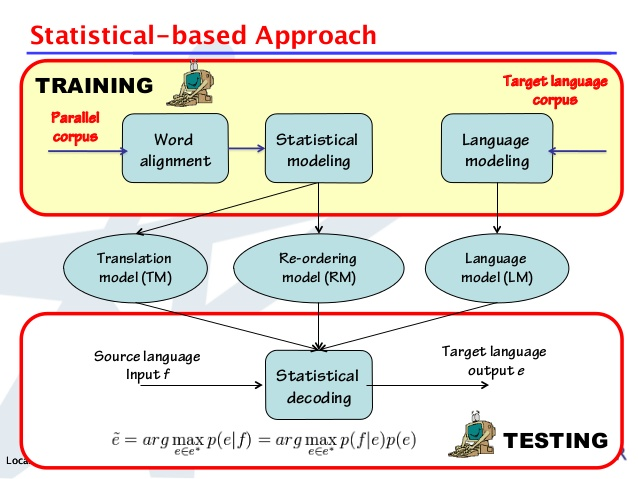

#**The Basic Phrase-Based Statistical Machine Translation Tool**

**Author:** [Dr. Ivan S. Zapreev](https://nl.linkedin.com/in/zapreevis)

**Project pages:** [Git-Hub-Project](https://github.com/ivan-zapreev/Back-Off-Language-Model-SMT)

##Introduction
This is a fork project from the Back Off Language Model(s) for SMT project aimed at creating the entire phrase-based SMT translation infrastructure. This project follows a client/server atchitecture based on WebSockets for C++ and consists of the three main applications:

+ **bpbd-client** - is a thin client to send the translation job requests to the translation server and obtain results
+ **bpbd-server** - the the translation server consisting of the following main components:
    - *Decoder* - the decoder component responsible for translating text from one language into another
    - *LM* - the language model implementation allowing for seven different trie implementations and responsible for estimating the target language phrase probabilities.
    - *TM* - the translation model implementation required for providing source to target language phrase translation and the probailities thereof.
    - *RM* - the reordering model implementation required for providing the possible translation order changes and the probabilities thereof
+ **lm-query** - a stand-alone language model query tool that allows to perform labguage model queries and estimate the joint phrase probabilities.

To keep a clear view of the used terminology further we will privide some details on the phrase based statistical machine translation as given on the picture below.



The entire phrase-based statistical machine translation is based on learned statistical correlations between words and phrases of an example translation text, also called parallel corpus or corpora. Clearly, if the training corpora is large enough then it allows to cover most source/target language words and phrases and shall have enough information for approximating a translation of an arbitrary text. However, before this information can be extracted, the parallel corpora undergoes the process called _word alignment_ which is aimed at estimating which words/phrases in the source language correspond to which words/phrases in the target language. As a result, we obtain two statistical models:

1. The Translation model - providing phrases in the source language with learned possible target language translations and the probabilities thereof.
2. The Reordering model - storing information about probable translation orders of the phrases within the source text, based on the observed source and target phrases and alignment thereof.

The last model, possibly learned from a different corpus in a target language, is the Language model. Its purpose is to reflect the likelihood of this or that phrase in the target language to occur. In other words it is used to evaluate the obtained translation for being _sound_ in the target language.
 
With these three models at hand one can perform decoding, which is a synonim to a translation process. SMT decoding is performed by exploring the state space of all possible translations and reorderings of the source language phrases within one sentence and then looking for the most probable translations, as indicated at the bottom part of the picture above.
 
The rest of the document is organized as follows:

1. [Project structure](#project-structure) - Gives the file and folder structure of the project
2. [Supported platforms](#supported-platforms) - Indicates the project supported platforms
3. [Building the project](#building-the-project) - Describes the process of building the project
4. [Using software](#using-software) - Explain how the software is to be used
5. [Input file formats](#input-file-formats) - Provides examples of the input file formats
6. [Code documentation](#code-documentation) - Refers to the project documentation
7. [External libraries](#external-libraries) - Lists the included external libraries
8. [General design](#general-design) - Outlines the general software desing
9. [Software details](#software-details) - Goes about some of the software details
10. [Literature and references](#literature-and-references) - Presents the list of used literature
11. [Licensing](#licensing) - States the licensing strategy of the project
12. [History](#history) - Stores a short history of this document


##Project structure
This is a Netbeans 8.0.2 project, based on cmake, and its top-level structure is as follows:

* **`[Project-Folder]`**/
    * **doc/** - contains the project-related documents including the Doxygen-generated code documentation and images
    * **ext/** - stores the external header only libraries used in the project
    * **inc/** - stores the C++ header files of the implementation
    * **src/** - stores the C++ source files of the implementation
    * **nbproject/** - stores the Netbeans project data, such as makefiles
    * **data/** - stores the test-related data such as test models and query intput files, as well as some experimental results.
    * LICENSE - the code license (GPL 2.0)
    * CMakeLists.txt - the cmake build script for generating the project's make files
    * README.md - this document
    * Doxyfile - the Doxygen configuration file

##Supported platforms
This project supports two major platforms: Linux and Mac Os X. It has been successfully build and tested on:

* **Centos 6.6 64-bit** - Complete functionality.
* **Ubuntu 15.04 64-bit** - Complete functionality.
* **Mac OS X Yosemite 10.10 64-bit** - Limited by inability to collect memory-usage statistics.

**Notes:**

1. There was only a limited testing performed on 32-bit systems.
2. The project must be possible to build on Windows platform under [Cygwin](https://www.cygwin.com/).

##Building the project
Building this project requires **gcc** version >= *4.9.1* and **cmake** version >= 2.8.12.2. The project can be build in two ways:

+ From the Netbeans environment by running Build in the IDE
    - Perform `mkdir build` in the project folder.
    - In Netbeans menu: *Tools/Options/"C/C++"* make sure that the cmake executable is properly set.
    - Netbeans will always run cmake for the DEBUG version of the project
    - To build project in RELEASE version use building from Linux console
+ From the Linux command-line console perform the following steps
    - `cd [Project-Folder]`
    - `mkdir build`
    - `cd build`
    - `cmake -DCMAKE_BUILD_TYPE=Release ..` OR `cmake -DCMAKE_BUILD_TYPE=Debug ..`
    - `make -j [NUMBER-OF-THREADS]` add `VERBOSE=1` to make the compile-time options visible

The binaries will be generated and placed into *./build/* folder. In order to clean the project from the command line run `make clean`. Cleaning from Netbeans is as simple calling the `Clean and Build` from the `Run` menu.

###Project compile-time parameters
There is a number of project parameters that at this moment are to be chosen only once before the project is compiled. These are otherwise called the compile-time parameters. Further we consider the most important of them and indicate where all of them are to be found.

**Loggin level:** Logging is important when debugging software or providing an additional used information during the program's runtime. Yet additional output actions come at a prise and can negatively influence the program's performance. This is why it is important to be able to disable certain logging levels within the program not only during its runtime but also at compile time. The possible range of project's logging levels, listed incrementally is: ERROR, WARNING, USAGE, RESULT, INFO, INFO1, INFO2, INFO3, DEBUG, DEBUG1, DEBUG2, DEBUG3, DEBUG4. One can limit the logging level range available at runtime by setting the `LOGER_M_GRAM_LEVEL_MAX` constaint value in the `./inc/common/utils/logging/logger.hpp` header file.

**Sanity checks:** When program is not running as expected, it could be caused by the internal software errors that are not detectable runtime. It is therefore possible to enable/disable software internal sanity checks by setting the `DO_SANITY_CHECKS` constand in the `./inc/common/utils/exceptions.hpp` header file. Note that enabling the sanity checks does not guarantee that the internal error will be found and will have a negative effect on the program's performance. Yet, it might help to identify errors with e.g. input file formats and alike.

**Server configs:** There is a number of translation server common parameters used in decoding, translation, reordering anb language models. Those are to be found in the `./inc/server/server_configs.hpp`. Please be carefull changing them:

* `UNKNOWN_LOG_PROB_WEIGHT` - The value used for the unknown probability weight _(log10 scale)_
* `ZERO_LOG_PROB_WEIGHT` - The value used for the 'zero' probability weight _(log10 scale)_
* `tm::NUM_TM_FEATURES` - The number of the translation model features, defines the number of features read per entry in from the translation model input file.
* `tm::TM_MAX_TARGET_PHRASE_LEN` - The maximum length of the target phrase to be considered, this defines the maximum number of tokens to be stored per translation entry
* `lm::NUM_LM_FEATURES` - The number of languahe model features, the program currenly supports only one value: `1`
* `lm::LM_M_GRAM_LEVEL_MAX` - The languahe model maximum level, the maximum number of words in the language model phrase
* `lm::LM_HISTORY_LEN_MAX` - **DO NOT CHANGE**
* `lm::LM_MAX_QUERY_LEN` - **DO NOT CHANGE**
* `lm::DEF_UNK_WORD_LOG_PROB_WEIGHT` - The default unknown word probability weight, for the case the `<unk>` entry is not present in the language model file _(log10 scale)_
* `rm::NUM_RM_FEATURES` - The maximum number of reordering model features, the only two currently supported values are: `6` and `8`. 

**Decoder configs:** There is a number of decoder-specific parameters that can be configured runtime. These are located in `./inc/server/decoder/de_configs.hpp`, please be careful changing them:

* `MAX_WORDS_PER_SENTENCE` - 

**LM configs:** There is a number of Language-model-specific parameters that can be configured runtime. These are located in `./inc/server/lm/lm_configs.hpp`, please be careful changing them:

* `lm_word_index` - 
* `lm_model_type` - 
* `lm_builder_type` - 

**TM configs:** There is a number of Translation-model-specific parameters that can be configured runtime. These are located in `./inc/server/tm/tm_configs.hpp`, please be careful changing them:

* `tm_model_type` - 
* `tm_builder_type` - 

**RM configs:** There is a number of Reordering-model-specific parameters that can be configured runtime. These are located in `./inc/server/rm/rm_configs.hpp`, please be careful changing them:

* `rm_model_type` - 
* `rm_builder_type` - 

##Using software

###_bpbd-server_ - translation server
###_bpbd-client_ - translation client
###_lm-query_ - language model query tool
In order to get the program usage information please run *./lm-query* from the command line, the output of the program is supposed to be as follows:

``` 
vpn-stud-146-50-150-5:build zapreevis$ lm-query 
USAGE:  ------------------------------------------------------------------ 
USAGE: |                 Back Off Language Model(s) for SMT     :)\___/(: |
USAGE: |                       Software version 1.1             {(@)v(@)} |
USAGE: |                         The Owl release.               {|~- -~|} |
USAGE: |            Copyright (C) Dr. Ivan S Zapreev, 2015-2016 {/^'^'^\} |
USAGE: |  ═════════════════════════════════════════════════════════m-m══  |
USAGE: |        This software is distributed under GPL 2.0 license        |
USAGE: |          (GPL stands for GNU General Public License)             |
USAGE: |          The product comes with ABSOLUTELY NO WARRANTY.          |
USAGE: |   This is a free software, you are welcome to redistribute it.   |
USAGE: |                     Running in 64 bit mode!                      |
USAGE: |                 Build on: Mar 10 2016 17:11:35                   |
USAGE:  ------------------------------------------------------------------ 
PARSE ERROR:  
             Required arguments missing: query, model

Brief USAGE: 
   lm-query  [-l <lm lambda weight>] [-d <error|warn|usage|result|info
             |info1|info2|info3>] -q <query file name> -m <model file name>
             [--] [--version] [-h]

For complete USAGE and HELP type: 
   lm-query --help
```

##Input file formats
###Translatin model
_ToDo: Extend_

###Reordering model
_ToDo: Extend_

###Language model
For machine translation it is important to estimate and compare the fluency of different possible translation outputs for the same source (i.e., foreign) sentence. This is commonly achieved by using a language model, which measures the probability of a string (which is commonly a sentence). Since entire sentences are unlikely to occur more than once, this is often approximated by using sliding windows of words (n-grams) occurring in some training data.

####Language Models background
An *n-gram* refers to a continuous sequence of n tokens. For instance, given the following sentence: `our neighbor , who moved in recently , came by .` If n = 3, then the possible n-grams of
this sentence include:

```
"our neighbor ,"
"neighbor , who"
", who moved"
...
", came by"
"came by ."
```
Note that punctuation marks such as comma and full stop are treated just like any _real_ word and that all words are lower cased.

##Code documentation
_ToDo: Extend with more details_

At present the documentation is done in the Java-Doc style that is successfully accepted by Doxygen with the Doxygen option *JAVADOC_AUTOBRIEF* set to *YES*. The generated documentation is located in the **./docs/** folder of the project.

##External libraries
_ToDo: Write this section_

##General design

_ToDo: Add the general design, the current and the future one withg images_

##Software details
###_bpbd-client_
_ToDo: Add details on how the client works including requirements and structure_
###_bpbd-server_
_ToDo: Add details on how the server works including requirements and structure_
###_lm-query_
_ToDo: Update details on how the query tool works including requirements and structure_

In this section we mention a few implementation details, for more details see the source code documentation. The code contains the following important source files:

* **main.cpp** - contains the entry point of the program
* **Executor.cpp** -  contains some utility functions including the one reading the test document and performing the queries on a filled in Trie instance.
* **ARPATrieBuilder.hpp / ARPATrieBuilder.cpp** - contains the class responsible for reading the ARPA file format and building up the trie model using the ARPAGramBuilder.
* **TrieDriver.hpp** - is the driver for all trie implementations - allows to execute queries to the tries.
* **LayeredTrieDriver.hpp** - is a wrapper driver for all the layered trie implementations - allows to retrieve N-gram probabilities and back-off weights.
* **C2DHashMapTrie.hpp / C2DHashMapTrie.cpp** - contains the Context-to-Data mapping trie implementation based on unordered_map.
* **C2DMapArrayTrie.hpp / C2DMapArrayTrie.cpp** - contains the Context-to-Data mapping trie implementation based  on unordered_map and ordered arrays.
* **C2WOrderedArrayTrie.hpp / C2WOrderedArrayTrie.cpp** - contains the Context-to-Word mapping trie implementation based on ordered arrays.
* **G2DHashMapTrie.hpp / G2DHashMapTrie.cpp** - contains the M-Gram-to-Data mapping trie implementation based on self-made hash maps.
* **W2CHybridMemoryTrie.hpp / W2CHybridMemoryTrie.cpp** - contains the Word-to-Context mapping trie implementation based on unordered_map and ordered arrays.
* **W2COrderedArrayTrie.hpp / W2COrderedArrayTrie.cpp** - contains the Word-to-Context mapping trie implementation based on ordered arrays.
* **Configuration.hpp** - contains configuration parameter for the word index and trie and memory management entities.
* **Exceptions.hpp** - stores the implementations of the used exception classes.
* **HashingUtils.hpp** - stores the hashing utility functions.
* ** ARPAGramBuilder.hpp / ARPAGramBuilder.cpp** - contains the class responsible for building n-grams from a line of text and storing it into Trie.
* **StatisticsMonitor.hpp / StatisticsMonitor.cpp** - contains a class responsible for gathering memory and CPU usage statistics
* **Logger.hpp/Logger.cpp** - contains a basic logging facility class

##Literature and references

This project is originally based on the followin literature:

_ToDo: Put the BibText entries into linked files_

>        @inproceedings{DBLP:conf/acl/PaulsK11,
>        author    = {Adam Pauls and
>                       Dan Klein},
>          title     = {Faster and Smaller N-Gram Language Models},
>          booktitle = {The 49th Annual Meeting of the Association for Computational Linguistics:
>                       Human Language Technologies, Proceedings of the Conference, 19-24
>                       June, 2011, Portland, Oregon, {USA}},
>          pages     = {258--267},
>          year      = {2011},
>          crossref  = {DBLP:conf/acl/2011},
>          url       = {http://www.aclweb.org/anthology/P11-1027},
>          timestamp = {Fri, 02 Dec 2011 14:17:37 +0100},
>          biburl    = {http://dblp.uni-trier.de/rec/bib/conf/acl/PaulsK11},
>          bibsource = {dblp computer science bibliography, http://dblp.org}
>        }

and

>        @inproceedings{DBLP:conf/dateso/RobenekPS13,
>          author    = {Daniel Robenek and
>                       Jan Platos and
>                       V{\'{a}}clav Sn{\'{a}}sel},
>          title     = {Efficient In-memory Data Structures for n-grams Indexing},
>          booktitle = {Proceedings of the Dateso 2013 Annual International Workshop on DAtabases,
>                       TExts, Specifications and Objects, Pisek, Czech Republic, April 17,
>                       2013},
>          pages     = {48--58},
>          year      = {2013},
>          crossref  = {DBLP:conf/dateso/2013},
>          url       = {http://ceur-ws.org/Vol-971/paper21.pdf},
>          timestamp = {Mon, 22 Jul 2013 15:19:57 +0200},
>          biburl    = {http://dblp.uni-trier.de/rec/bib/conf/dateso/RobenekPS13},
>          bibsource = {dblp computer science bibliography, http://dblp.org}
>        }

_ToDo: Add the paper of Ken LM_
_ToDo: Add the SMT book_

The first paper discusses optimal Trie structures for storing the learned text corpus and the second indicates that using *std::unordered_map* of C++ delivers one of the best time and space performances, compared to other data structures, when using for Trie implementations

_ToDo: Add more details about the papers and books_

##Licensing
This is a free software: you can redistribute it and/or modify it under the terms of the GNU General Public License as published by the Free Software Foundation, either version 3 of the License, or (at your option) any later version. This software is distributed in the hope that it will be useful, but WITHOUT ANY WARRANTY; without even the implied warranty of MERCHANTABILITY or FITNESS FOR A PARTICULAR PURPOSE.  See the GNU General Public License for more details. You should have received a copy of the GNU General Public License along with this program.  If not, see <http://www.gnu.org/licenses/>.

##History
* **21.04.2015** - Created
* **27.07.2015** - Changed project name and some to-do's
* **21.09.2015** - Updated with the latest developments preparing for the version 1, Owl release. 
* **11.03.2016** - Updated Updated to reflect the project status. 


 _Powered by [Markdown-Cheatsheet](https://github.com/adam-p/markdown-here/wiki/Markdown-Cheatsheet)_
