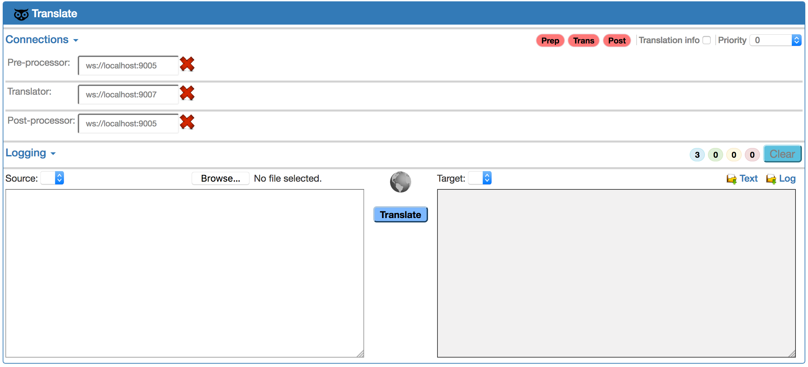

# **The basic translation infrastructure demo with TLS support**

**Author:** [Dr. Ivan S. Zapreev](https://nl.linkedin.com/in/zapreevis)

**Demo pages:** [Git-Hub-Demo-Pages](https://github.com/ivan-zapreev/Distributed-Translation-Infrastructure/tree/master/demo/tls)

**Parent project:** [Distributed Translation Infrastructure](https://github.com/ivan-zapreev/Distributed-Translation-Infrastructure)

## Introduction

This is a small demonstration set-up created for the sake of making a demonstration of the distributed translation infrastructure, assumed to be present in a `<DTI_HOME>` folder on the reader's hard drive. This demo features multiple translation services, basic text pre/post-processing, aggregation of multiple source language translation servers, and [TLS/SSL](https://en.wikipedia.org/wiki/Transport_Layer_Security)-based communications.

## Directories

Relative to the [Distributed Translation Infrastructure](https://github.com/ivan-zapreev/Distributed-Translation-Infrastructure) project home folder `<DTI_HOME>` the demo is located in `<DTI_HOME>/demo/tls/`. The structure of the demo is as follows:

```
$ tree .
├── README.md
├── certificates
│   ├── ca2048.crt
│   ├── ca2048.key
│   ├── ca2048.srl
│   ├── client2048.crt
│   ├── client2048.csr
│   ├── client2048.key
│   ├── dh1024.pem
│   ├── dh2048.pem
│   └── dh4096.pem
├── configs
│   ├── balancer-mixed-tls.cfg
│   ├── client-mixed-tls.cfg
│   ├── client-no-tls.cfg
│   ├── client-tls.cfg
│   ├── processor-no-tls.cfg
│   ├── processor-tls.cfg
│   ├── server-no-tls.cfg
│   └── server-tls.cfg
├── imgs
│   ├── browser_connected.png
│   ├── browser_exceptions.png
│   ├── browser_initial.png
│   └── browser_resulting.png
├── models
│   ├── chinese.english.head.10.rm.zip
│   ├── chinese.english.head.10.tm.zip
│   ├── de-en-1-10.000.rm.zip
│   ├── de-en-1-10.000.tm.zip
│   ├── e_00_1000.lm.zip
│   ├── english.bitext.lm.zip.aa
│   ├── english.bitext.lm.zip.ab
│   └── english.bitext.lm.zip.ac
├── start.sh
└── test
    ├── chinese.txt
    ├── english.txt
    └── german.txt
```

In the listing above:

- `./README.md` - the information file you are reading;
- `./certificates/` - the certificates and keys for SSL/TLS;
- `./configs/` - the server's configuration files; 
- `./imgs /` - the images used for this `README.md`
- `./models/` - the compressed model files;
- `./start.sh` - is the script to start-up and run the infrastructure;
- `./test/` - the source/target texts;

## SSL/TLS set-up

In order to run this demo one requires [OpenSSL](https://www.openssl.org/) installed on the machine as well as the [Distributed Translation Infrastructure](https://github.com/ivan-zapreev/Distributed-Translation-Infrastructure) project being compiled with TLS support, see [project's building instructions](../../#building-the-project) for more details.

The SSL/TLS certificates used for all secure communications are stored in the `<DTI_HOME>/demo/tls/certificates` folder. These have been generated with the use of the ``<DTI_HOME>/scripts/ssl` script.

## Deployment

All the server are run on localhost but use different ports. The following deployment is ensured by the corresponding configuration files:

- **ws://localhost:9001** - `bpbd-server -c ./configs/server.1.cfg` translating *German* to *French*;
- **ws://localhost:9002** - `bpbd-server -c ./configs/server.2.cfg` translating *Chinese* to *English*;
- **ws://localhost:9003** - `bpbd-server -c ./configs/server.3.cfg` translating *German* to *English*;
- **ws://localhost:9004** - `bpbd-server -c ./configs/server.4.cfg` translating *German* to *English*;
- **ws://localhost:9005** - `bpbd-processor -c./configs/processor.cfg` performs both *pre-* and *post-* processing;
- **ws://localhost:9007** - `bpbd-balancer -c ./configs/balancer.cfg` balances load and distributes requests for all the translation servers;

## Important notes

* Text *pre-* and *post-* processing is done using the demonstration scripts `pre_process.sh` and `post_process.sh ` located in `<DTI_HOME>/script/text/`;
* The `pre_process.sh` script has a dummy language detection, the language is always detected to be *German*;
* The models used for the servers are either fake or have minimal size. This is due to size limitations of the repository;
* The translating from *German* to *French* or *German* to *English* will not provide any decent results due to used dummy models;
* The only remotely useful translation, enough for demonstration purposes, can be done from *Chinese* to *English*;
* The *Chinese* to *English* translation model is filtered to only provide decent translation for `./test/chinese.txt`;
* The reference *Chinese* to *English* translation of `./test/chinese.txt`, done on full-scale models, is located in `./test/english.txt`.

## Running

In order to run the demo consider the following steps:

* Open the `<DTI_HOME>/script/web/translate.html` document in one of the web-browsers: 



* Note that the **Pre**, **Trans**, and **Post** connection indicators are all red, meaning the servers are not running;
* Open the Linux terminal and change directory to the `<DTI_HOME>/demo/tls/` folder;
* Run the `./start.sh` script from that same terminal;
* Wait until the following message appears in the terminal: 

```
INFO: Please press enter to STOP the servers and finish...
```

* From another terminal run `screen -r` to make sure there is *6* screens running. You may connect to each of them to get access to the corresponding server's command line.
* Keep refreshing the `<DTI_HOME>/script/web/translate.html` page in the browser, until it is in the following state:


* Please note that here:
    * Getting this state shall not take longer than several minutes;
    * The **Pre**, **Trans**, and **Post** connection indicators will become green;
    * The **Source** language will be set to `--detect--`;
* Copy the content of the `<DTI_HOME>/demo/tls/test/chinese.txt` file into the **Source** text box of the `<DTI_HOME>/script/web/translate.html` document inside the browser;
* Select the **Source** language to be *Chinese* and click the **Translate** button;
* Wait until the translation process is finished, the resulting state shall be as follows:


* You may want compare the translation result to that stored in  `<DTI_HOME>/demo/tls/test/english.txt` and obtained using full-scale models;
* Return to the terminal running the `./script.sh` and press **Enter** to terminate the servers and finish the demo;